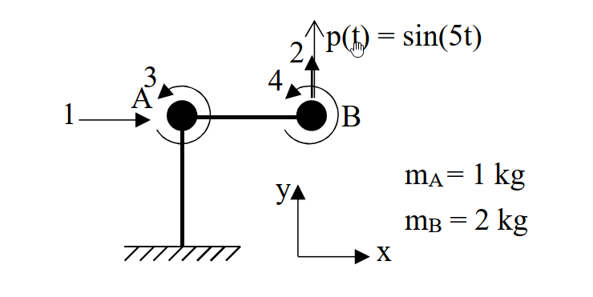

# 考題編號：[SD-2022-1]

**主分類：** `SD-U1-3` 單自由度、多自由度系統之動態分析及應用
**副分類：** `SD-U1-2` 運動方程式推導
**分析方法：** MDOF模態分析
**標籤：** `MDOF` `直接勁度法` `靜態濃縮` `運動方程式` `穩態反應`

---

## 1. 原始題目重述 (Problem Restatement)

一、剛構架受動態載重如下圖，忽略軸向變形、構架質量以及節點 A、B 集中質量的旋轉慣量，假設柱以及梁的長度 $L$ 均為 3 m、撓曲剛度 $EI$ 值均為 $2000 \text{ N/m}^2$，在第 2 自由度上受向上為正的簡諧外力作用。回答下列問題：
(1) 請依圖上所示自由度編號以直接勁度法建立四自由度的勁度矩陣以及質量矩陣後利用靜態濃縮方法將勁度矩陣以及質量矩陣濃縮為2自由度（1 以及 2）矩陣。（10 分）
(2) 假設沒有阻尼力，根據子題(1)結果建立第一及第二振態運動方程式。（10 分）
(3) 假設各振態阻尼比皆為0.03，求自由度 2 的穩態位移振幅。（5 分）

*圖說：單跨 L 型剛構架，節點 A、B 分別具有集中質量 $m_A = 1\text{ kg}$、$m_B = 2\text{ kg}$，自由度1為水平位移，自由度2為B點垂直位移，自由度3、4為A、B點旋轉。外力 $p(t) = \sin(5t)$ 作用於自由度2。*

## 2. 考題核心精神與出題者意圖 (Core Concepts & Examiner's Intent)

本題旨在測驗考生對於 **多自由度系統 (MDOF)** 動力分析的完整掌握程度，涵蓋從結構力學的「直接勁度法組裝」與「靜態濃縮 (Static Condensation)」，到動力學的「特徵值分析 (Eigenvalue Problem)」、「模態方程式解耦」，最後是「含阻尼穩態受迫振動反應」的計算。

出題者意圖包含以下幾點：
1. 檢驗考生是否能正確組裝含剛性軸向變形假設的局部勁度矩陣。
2. 測驗「靜態濃縮」的矩陣操作，因為旋轉自由度無對應質量，可將其從動力分析中濃縮，降階為二自由度系統以簡化手算。
3. 測驗建立模態方程式時，是否能正確計算參與質量並進行單位正規化。
4. 測驗複數頻率域的穩態反應，或是直接利用模態疊加法求解穩態解的振幅。

## 3. 解題戰略地圖與陷阱分析 (Strategic Roadmap & Trap Analysis)

- **步驟 1：組裝 4x4 質量與勁度矩陣**
  明確對應自由度 $(u_1, u_2, u_3, u_4)$。注意水平自由度 $u_1$ 因為梁軸向剛性，使得 $m_A$ 和 $m_B$ 同時具有 $u_1$ 的水平加速度，質量需疊加。
- **步驟 2：靜態濃縮**
  利用 $K^* = K_{aa} - K_{ab} K_{bb}^{-1} K_{ba}$ 進行降階，得到 2x2 的動力勁度矩陣 $K^*$ 與質量矩陣 $M^*$。
  **陷阱：** 矩陣分割時必須確定 $a$ 為平移自由度 (1,2)，$b$ 為旋轉自由度 (3,4)。
- **步驟 3：特徵值分析與模態解耦**
  求解 $\det(K^* - \omega^2 M^*) = 0$ 得到自然頻率 $\omega_1, \omega_2$ 與振態向量 $\phi_1, \phi_2$。
  計算模態質量 $M_n$ 與模態力 $P_n(t)$，寫出 $\ddot{q}_n + \omega_n^2 q_n = P_n(t) / M_n$。
- **步驟 4：阻尼穩態反應**
  加入阻尼項，求各模態穩態解 $q_n(t)$，最後透過 $u_2(t) = \phi_{12} q_1(t) + \phi_{22} q_2(t)$ 疊加求得總穩態位移的振幅。
  **陷阱：** 穩態反應的疊加必須考慮「相位差」。不可直接將兩模態的振幅相加，必須利用向量疊加 (複數相加或三角函數展開) 來求合振幅。本題中 $p(t)$ 頻率 $\Omega = 5$ 介於 $\omega_1$ 和 $\omega_2$ 之間，會產生接近 $180^\circ$ 的相位差。

## 3.5 變數層次分析 (Variable Hierarchy Analysis)

### 最終目標
`求出自由度 2 在諧和外力下的穩態位移總振幅`

### 本題關鍵公式（依計算順序）
- 靜態濃縮勁度矩陣：$K^* = K_{aa} - K_{ab} K_{bb}^{-1} K_{ba}$
- 特徵方程式：$\det(\boxed{K^*} - \omega^2 \boxed{M^*}) = 0$
- 模態方程式：$\ddot{q}_n + 2\xi\omega_n \dot{q}_n + \boxed{\omega_n^2} q_n = \frac{\phi_n^T P}{\phi_n^T \boxed{M^*} \phi_n}$
- 穩態模態解振幅：$|q_n| = \frac{|P_{n0}|/M_n}{\sqrt{(\omega_n^2 - \Omega^2)^2 + (2\xi\omega_n\Omega)^2}}$
- 總反應振幅：$U_2 = \max | \phi_{12} \boxed{q_1(t)} + \phi_{22} \boxed{q_2(t)} |$

### L1：題目直接給定
| 符號 | 數值 | 說明 |
|---|---|---|
| $L$ | $3 \text{ m}$ | 柱、梁長度 |
| $EI$ | $2000 \text{ N/m}^2$ | 梁柱撓曲剛度 |
| $m_A$ | $1 \text{ kg}$ | A點集中質量 |
| $m_B$ | $2 \text{ kg}$ | B點集中質量 |
| $p(t)$ | $\sin(5t)$ | 外力函數，頻率 $\Omega = 5 \text{ rad/s}$ |
| $\xi$ | $0.03$ | 各振態阻尼比 |

### L2：需知識點推導
| 符號 | 公式／來源 | 卡關? |
|---|---|---|
| **矩陣組裝** | | |
| $M_{4\times4}$ | 考慮質量連動 $M_{11} = m_A + m_B$, $M_{22} = m_B$ | |
| $K_{4\times4}$ | 將柱及梁的局部剛度矩陣對應至整體自由度 | |
| **動力濃縮** | | |
| $K^*$ | $K_{aa} - K_{ab} K_{bb}^{-1} K_{ba}$ | |
| **模態屬性** | | |
| $\omega_n, \phi_n$ | 由 $(K^* - \omega^2 M^*)\phi = 0$ 求解 | |
| $M_n$ | 模態質量 $\phi_n^T M^* \phi_n$ | |
| **穩態反應** | | |
| $q_n(t)$ | 穩態解之複數法或公式解 $|q_n| e^{i(\Omega t - \theta_n)}$ | |
| $U_2$ | 疊加兩模態的時域解後求振幅 (需考慮相位) | |

### L3：深層知識（不懂就卡住）
| 知識點 | 說明 | 卡關? |
|---|---|---|
| 剛性樓板/軸向剛性假設 | 梁的軸向變形忽略，導致A、B點水平位移必須完全相同，質量需疊加至同一個自由度。 | |
| 穩態疊加的相位考量 | 兩模態對於同一頻率外力的穩態響應相位不同，疊加時必須分離 $\sin$ 與 $\cos$ 項，不可直接把振幅數值相加。 | |

## 4. 步驟化詳細計算過程 (Step-by-Step Detailed Calculation)

### (1) 四自由度勁度與質量矩陣及靜態濃縮

**1. 四自由度矩陣組裝**
依題意，自由度定義為：
- $u_1$：節點 A, B 之水平位移（因梁軸向剛性，兩者相等）
- $u_2$：節點 B 之垂直位移（柱軸向剛性，A點垂直位移為0）
- $u_3$：節點 A 之旋轉角
- $u_4$：節點 B 之旋轉角

**質量矩陣 $M$**
因為 $u_1$ 發生時，節點 A 與 B 皆有加速度 $\ddot{u}_1$，對應慣性力為 $(m_A + m_B)\ddot{u}_1$；$u_2$ 發生時僅節點 B 有加速度。旋轉自由度無質量。
$$
M = \begin{bmatrix} m_A+m_B & 0 & 0 & 0 \\ 0 & m_B & 0 & 0 \\ 0 & 0 & 0 & 0 \\ 0 & 0 & 0 & 0 \end{bmatrix} = \begin{bmatrix} 3 & 0 & 0 & 0 \\ 0 & 2 & 0 & 0 \\ 0 & 0 & 0 & 0 \\ 0 & 0 & 0 & 0 \end{bmatrix} \text{ (kg)}
$$

**勁度矩陣 $K$**
令代數符號 $EI, L$ 進行組裝：
- **柱 OA** (長度 $L$) 貢獻於 $u_1, u_3$：
  $K_{11} = \frac{12EI}{L^3}$， $K_{13} = K_{31} = \frac{6EI}{L^2}$， $K_{33}^{(OA)} = \frac{4EI}{L}$
- **梁 AB** (長度 $L$) 貢獻於 $u_2, u_3, u_4$ (注意梁無水平位移彎曲)：
  $v_A=0, v_B=u_2, \theta_A=u_3, \theta_B=u_4$。
  $K_{22} = \frac{12EI}{L^3}$
  $K_{23} = K_{32} = -\frac{6EI}{L^2}$， $K_{24} = K_{42} = -\frac{6EI}{L^2}$
  $K_{33}^{(AB)} = \frac{4EI}{L}$， $K_{34} = K_{43} = \frac{2EI}{L}$， $K_{44} = \frac{4EI}{L}$

合併後之四自由度勁度矩陣：
$$
K = \begin{bmatrix} 
\frac{12EI}{L^3} & 0 & \frac{6EI}{L^2} & 0 \\ 
0 & \frac{12EI}{L^3} & -\frac{6EI}{L^2} & -\frac{6EI}{L^2} \\ 
\frac{6EI}{L^2} & -\frac{6EI}{L^2} & \frac{8EI}{L} & \frac{2EI}{L} \\ 
0 & -\frac{6EI}{L^2} & \frac{2EI}{L} & \frac{4EI}{L} 
\end{bmatrix}
$$
代入 $L=3 \text{ m}, EI=2000 \text{ N/m}^2$，得：
$$
K = \frac{4000}{9} \begin{bmatrix} 2 & 0 & 3 & 0 \\ 0 & 2 & -3 & -3 \\ 3 & -3 & 12 & 3 \\ 0 & -3 & 3 & 6 \end{bmatrix} \text{ (N/m)}
$$

**2. 靜態濃縮至自由度 1, 2**
分割矩陣：$K = \begin{bmatrix} K_{aa} & K_{ab} \\ K_{ba} & K_{bb} \end{bmatrix}$，其中 $a=(1,2), b=(3,4)$。
$$
K_{bb}^{-1} = \left( \frac{4000}{9} \right)^{-1} \begin{bmatrix} 12 & 3 \\ 3 & 6 \end{bmatrix}^{-1} = \frac{9}{4000} \cdot \frac{1}{63} \begin{bmatrix} 6 & -3 \\ -3 & 12 \end{bmatrix}
$$
$$
K_{ab} K_{bb}^{-1} K_{ba} = \frac{4000}{9} \begin{bmatrix} 3 & 0 \\ -3 & -3 \end{bmatrix} \frac{1}{63} \begin{bmatrix} 6 & -3 \\ -3 & 12 \end{bmatrix} \begin{bmatrix} 3 & -3 \\ 0 & -3 \end{bmatrix} = \frac{4000}{63} \begin{bmatrix} 6 & -3 \\ -3 & 12 \end{bmatrix}
$$
$$
K^* = K_{aa} - K_{ab} K_{bb}^{-1} K_{ba} = \frac{4000}{9} \begin{bmatrix} 2 & 0 \\ 0 & 2 \end{bmatrix} - \frac{4000}{63} \begin{bmatrix} 6 & -3 \\ -3 & 12 \end{bmatrix} = \frac{4000}{63} \begin{bmatrix} 8 & 3 \\ 3 & 2 \end{bmatrix} = \begin{bmatrix} 507.94 & 190.48 \\ 190.48 & 126.98 \end{bmatrix} \text{ N/m}
$$
因為旋轉自由度無質量，$M^* = M_{aa}$。
$$
\boxed{ K^* = \frac{4000}{63} \begin{bmatrix} 8 & 3 \\ 3 & 2 \end{bmatrix} = \begin{bmatrix} 32000/63 & 12000/63 \\ 12000/63 & 8000/63 \end{bmatrix} \text{ N/m}, \quad M^* = \begin{bmatrix} 3 & 0 \\ 0 & 2 \end{bmatrix} \text{ kg} }
$$

### (2) 建立第一及第二振態運動方程式

**1. 特徵值分析**
求解 $\det(K^* - \omega^2 M^*) = 0$：
$$
\det \begin{bmatrix} \frac{32000}{63} - 3\omega^2 & \frac{12000}{63} \\ \frac{12000}{63} & \frac{8000}{63} - 2\omega^2 \end{bmatrix} = 0 \implies 6\omega^4 - \frac{88000}{63}\omega^2 + \frac{112000000}{3969} = 0
$$
解得特徵值：
$$
\omega_{1,2}^2 = \frac{2000(11 \mp \sqrt{79})}{189} \implies \left\{ \begin{array}{l} \omega_1^2 = 22.347 \text{ (rad/s)}^2 \implies \omega_1 = 4.727 \text{ rad/s} \\ \omega_2^2 = 210.457 \text{ (rad/s)}^2 \implies \omega_2 = 14.507 \text{ rad/s} \end{array} \right.
$$
對應之振態向量 (令 $\phi_1 = 1$)：
$$
\phi_n = \begin{bmatrix} 1 \\ \frac{-(5000/63 - 3\omega_n^2)}{2000/63} \end{bmatrix} \implies \phi_1 = \begin{bmatrix} 1 \\ \frac{-5-\sqrt{79}}{6} \end{bmatrix} = \begin{bmatrix} 1 \\ -2.3147 \end{bmatrix}, \quad \phi_2 = \begin{bmatrix} 1 \\ \frac{-5+\sqrt{79}}{6} \end{bmatrix} = \begin{bmatrix} 1 \\ 0.6480 \end{bmatrix}
$$

**2. 模態質量與模態力**
模態質量 $M_n = \phi_n^T M^* \phi_n$：
$M_1 = 3(1)^2 + 2(-2.3147)^2 = 13.716 \text{ kg}$
$M_2 = 3(1)^2 + 2(0.6480)^2 = 3.840 \text{ kg}$
外力向量 $P(t) = \begin{bmatrix} 0 \\ \sin(5t) \end{bmatrix}$ (僅作用於 DOF 2)。
模態力 $P_n(t) = \phi_n^T P(t)$：
$P_1(t) = -2.3147 \sin(5t)$
$P_2(t) = 0.6480 \sin(5t)$

**3. 無阻尼運動方程式**
$\ddot{q}_n + \omega_n^2 q_n = P_n(t) / M_n$
代入數值：
$$
\boxed{ \begin{array}{l} \text{第一振態：} \ddot{q}_1 + 22.347 q_1 = -0.1688 \sin(5t) \\ \text{第二振態：} \ddot{q}_2 + 210.457 q_2 = 0.1688 \sin(5t) \end{array} }
$$
*(註：若使用精確值，等號右側皆為 $\mp \frac{3}{2\sqrt{79}} \sin(5t)$)*

### (3) 自由度 2 的穩態位移振幅 ($\xi = 0.03$)

穩態模態反應方程式為 $\ddot{q}_n + 2\xi\omega_n \dot{q}_n + \omega_n^2 q_n = f_n \sin(\Omega t)$，其中 $\Omega = 5, f_1 = -0.16876, f_2 = 0.16876$。
穩態解設為 $q_n(t) = Q_{nc} \cos(5t) + Q_{ns} \sin(5t)$。

**對於第一振態：**
$\omega_1^2 = 22.347$, $2\xi\omega_1 = 2(0.03)(4.727) = 0.2836$
代入方程式並比較係數：
$-25 Q_{1c} + 5(0.2836) Q_{1s} + 22.347 Q_{1c} = 0 \implies -2.653 Q_{1c} + 1.418 Q_{1s} = 0$
$-25 Q_{1s} - 5(0.2836) Q_{1c} + 22.347 Q_{1s} = -0.16876 \implies -1.418 Q_{1c} - 2.653 Q_{1s} = -0.16876$
解得：$Q_{1c} = 0.02645, Q_{1s} = 0.04948$
故 $q_1(t) = 0.02645 \cos(5t) + 0.04948 \sin(5t)$

**對於第二振態：**
$\omega_2^2 = 210.457$, $2\xi\omega_2 = 2(0.03)(14.507) = 0.8704$
代入方程式並比較係數：
$185.457 Q_{2c} + 4.352 Q_{2s} = 0$
$-4.352 Q_{2c} + 185.457 Q_{2s} = 0.16876$
解得：$Q_{2c} = -0.00002, Q_{2s} = 0.00091$
故 $q_2(t) = -0.00002 \cos(5t) + 0.00091 \sin(5t)$

**總位移 $u_2(t)$ 疊加：**
$u_2(t) = \phi_{12} q_1(t) + \phi_{22} q_2(t) = (-2.3147) q_1(t) + (0.6480) q_2(t)$
分別計算 $\cos$ 與 $\sin$ 之係數 $u_{2c}, u_{2s}$：
$u_{2c} = (-2.3147)(0.02645) + (0.6480)(-0.00002) = -0.06123$
$u_{2s} = (-2.3147)(0.04948) + (0.6480)(0.00091) = -0.11394$
總位移函數為 $u_2(t) = -0.06123 \cos(5t) - 0.11394 \sin(5t)$
自由度 2 振幅為：
$$
U_2 = \sqrt{u_{2c}^2 + u_{2s}^2} = \sqrt{(-0.06123)^2 + (-0.11394)^2} = \sqrt{0.01673} = 0.1293 \text{ m}
$$

$$
\boxed{ \text{自由度 2 的穩態位移振幅為 } 0.1293 \text{ m} }
$$

## 5. 關鍵爭議點與進階探討 (Critical Issues & Advanced Discussion)

1. **相位差疊加重要性**：在子題(3)中，由於外力頻率 $\Omega = 5$ 介於 $\omega_1 (4.73)$ 與 $\omega_2 (14.51)$ 之間，第一振態的反應接近反相（相位角超過 $90^\circ$），而第二振態反應近乎同相（相位角接近 $0^\circ$）。若考生僅計算兩模態各自的振幅後直接相加 ($|u_{2,1}| + |u_{2,2}|$)，將會高估整體反應。必須確實展開為 $\sin$ 與 $\cos$ 項（或使用複數法）進行向量疊加，才能得到正確合振幅。
2. **阻尼對第二振態的影響極小**：由於 $\Omega$ 遠小於 $\omega_2$，第二振態在此頻率下屬於「準靜態反應」(quasi-static response)，阻尼力的影響微乎其微。實際上，直接忽略第二振態的阻尼所得結果差異極小。然而對於第一振態，因 $\Omega=5$ 相當靠近共振區 ($\omega_1=4.73$)，動力放大效應顯著且阻尼主導了相位的偏移，因此帶有阻尼的詳細運算是本題拿分的關鍵。
