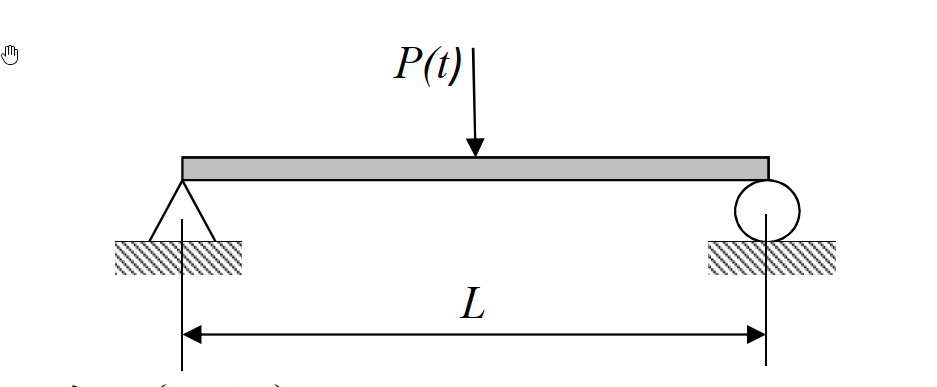

### 考題編號：SD-2023-1

**主分類：** `SD-U1-2` 運動方程式推導
**副分類：** `SD-U1-3` 單自由度、多自由度系統之動態分析及應用
**分析方法：** 連續體模態分析（梁振動）
**標籤：** `連續體梁` `Euler-Bernoulli梁` `簡支梁` `運動方程式` `模態分解法` `模態頻率` `模態函數` `模態載重函數` `偏微分方程` `分離變數法`

---

## 1. 原始題目重述

長度 $L$ 的均質等斷面簡支梁，斷面慣性矩為 $I$、彈性模數為 $E$、單位長度質量為 $\bar{m}$。梁中點 $x = L/2$ 處受鉛垂向下集中力 $P(t)$ 作用。

*圖說：均質等斷面簡支梁，兩端為鉸支承（彎矩為零、撓度為零），跨度 $L$，斷面參數 $EI$，單位長度質量 $\bar{m}$，集中力 $P(t)$ 作用於梁中點 $x = L/2$。*

**三個子問題：**
- (一) 推導運動方程式（8 分）
- (二) 證明第 $n$ 個模態之模態頻率 $\omega_n = \dfrac{n^2\pi^2}{L^2}\sqrt{\dfrac{EI}{\bar{m}}}$，且模態函數 $\phi_n(x) = \sin\!\left(\dfrac{n\pi x}{L}\right)$（12 分）
- (三) 求第 $n$ 個模態的模態載重函數（5 分）

---

## 2. 考題核心精神與出題者意圖

**核心觀念：** 連續體（分散式參數系統）的動力分析——從偏微分運動方程式出發，透過分離變數法求出模態頻率與模態函數，再應用模態正交性求模態載重函數。

**出題者意圖：**
1. 測驗是否能從 Euler-Bernoulli 梁理論推導含集中力的 PDE（不是由課本背答案）
2. 測驗分離變數法的操作流程與邊界條件的正確施加
3. 測驗模態正交性的應用：集中力作用於節點位置對特定模態的影響（偶數模態消失）

**考場關鍵：** 第(三)小題的模態載重函數要能解釋 $\sin(n\pi/2)$，說明偶數模態不受激振的物理意義，可加分。

---

## 3. 解題戰略地圖與陷阱分析

**作戰計畫：**
1. (一) 以 Euler-Bernoulli 梁微元分析 + D'Alembert 原理建立 PDE（含 Dirac delta 函數）
2. (二) 令自由振動解 $w = \phi(x)q(t)$，分離變數，解 ODE，施加四個邊界條件，得頻率方程式與模態函數
3. (三) 在模態方程式中，對方程式兩側乘以 $\phi_n(x)$ 並積分（利用正交性），提取模態載重函數

**關鍵陷阱：**

| # | 陷阱 | 應對策略 |
|---|------|---------|
| 1 | 忘記集中力要用 $\delta(x - L/2)$ 表示 | PDE 右端寫 $P(t)\delta(x - L/2)$ |
| 2 | 邊界條件混淆：簡支端為零撓度 + 零彎矩（不是零斜率！） | $w(0)=0$、$w''(0)=0$、$w(L)=0$、$w''(L)=0$ |
| 3 | 解特徵ODE時保留四項（$\sin, \cos, \sinh, \cosh$），邊界條件才能消去 $B, D, C$ | 不可預設只剩 $\sin$ |
| 4 | 模態載重函數忘記積分 $\delta$ 函數的性質：$\int f(x)\delta(x-a)dx = f(a)$ | 熟悉 Dirac delta 的抽樣性質 |

---

## 3.5 變數層次分析（Variable Hierarchy Analysis）

> 複習提示：第一次解題後，在每個卡住的知識點旁標記 `⚠`；第二次複習時只看有 `⚠` 的項目。

### 最終目標

`(一) PDE 運動方程式；(二) 證明 ωₙ 與 φₙ(x)；(三) 模態載重函數 Qₙ(t)`

### 本題關鍵公式（依計算順序）

> $\boxed{\cdot}$ = 需由前步驟推導，非題目直接給定的變數

$$\text{Step 1 (一): } \bar{m}\frac{\partial^2 w}{\partial t^2} + EI\frac{\partial^4 w}{\partial x^4} = P(t)\delta\!\left(x - \frac{L}{2}\right)$$

$$\text{Step 2 (二): 令 } w(x,t)=\phi(x)q(t),\quad \frac{\ddot{q}}{q} = -\frac{EI\phi''''}{\bar{m}\phi} = -\omega^2$$

$$\text{Step 3 (二): } \phi''''(x) - \boxed{\beta^4}\phi(x) = 0,\quad \beta^4 = \frac{\bar{m}\omega^2}{EI}$$

$$\text{Step 4 (二): 通解 } \phi(x) = A\sin\beta x + B\cos\beta x + C\sinh\beta x + D\cosh\beta x$$

$$\text{Step 5 (二): 施加 BC} \Rightarrow B=D=C=0,\;\sin(\beta_n L)=0 \Rightarrow \beta_n = \frac{n\pi}{L}$$

$$\text{Step 6 (二): } \omega_n = \boxed{\beta_n}^2\sqrt{\frac{EI}{\bar{m}}} = \frac{n^2\pi^2}{L^2}\sqrt{\frac{EI}{\bar{m}}}$$

$$\text{Step 7 (三): } Q_n(t) = \int_0^L P(t)\delta\!\left(x-\frac{L}{2}\right)\phi_n(x)\,dx = P(t)\sin\!\left(\frac{n\pi}{2}\right)$$

### L1：題目直接給定

| 符號 | 數值 | 說明 |
|------|------|------|
| $L$ | 梁長 | 均質等斷面簡支梁跨度 |
| $\bar{m}$ | 單位長度質量 | 均勻分布 |
| $EI$ | $E \cdot I$ | 撓曲剛度 |
| $P(t)$ | 集中力 | 作用於 $x = L/2$ |

### L2：需知識點推導

**Step 1：建立 PDE**

| 符號 | 公式／來源 | 卡關? |
|------|----------|:-----:|
| 撓曲剛度關係 | $M = EI\frac{\partial^2 w}{\partial x^2}$ | |
| 剪力關係 | $V = \frac{\partial M}{\partial x} = EI\frac{\partial^3 w}{\partial x^3}$ | |
| 集中力表示 | $P(t)\delta(x - L/2)$ | |
| 運動方程式 | $\bar{m}\ddot{w} + EIw'''' = P(t)\delta(x-L/2)$ | |

**Step 2：分離變數**

| 符號 | 公式／來源 | 卡關? |
|------|----------|:-----:|
| 假設 | $w(x,t) = \phi(x)q(t)$ | |
| 分離後時間ODE | $\ddot{q} + \omega^2 q = 0$ | |
| 分離後空間ODE | $\phi'''' - \beta^4\phi = 0$，$\beta^4 = \bar{m}\omega^2/EI$ | |

**Step 3：解空間ODE + 邊界條件**

| 符號 | 公式／來源 | 卡關? |
|------|----------|:-----:|
| 通解 | $A\sin\beta x + B\cos\beta x + C\sinh\beta x + D\cosh\beta x$ | |
| BC: $\phi(0)=0$ | → $B + D = 0$ | |
| BC: $\phi''(0)=0$ | → $-B\beta^2 + D\beta^2 = 0$ → $B=D=0$ | |
| BC: $\phi(L)=0$ | → $A\sin\beta L + C\sinh\beta L = 0$ | |
| BC: $\phi''(L)=0$ | → $-A\sin\beta L + C\sinh\beta L = 0$ | |
| 由上兩式 | $C = 0$，$\sin\beta_n L = 0$ | |
| 頻率方程式 | $\beta_n = n\pi/L$，$\omega_n = (n^2\pi^2/L^2)\sqrt{EI/\bar{m}}$ | |

**Step 4：模態載重函數**

| 符號 | 公式／來源 | 卡關? |
|------|----------|:-----:|
| 模態質量 | $M_n = \bar{m}\int_0^L\sin^2(n\pi x/L)dx = \bar{m}L/2$ | |
| 模態載重 | $Q_n(t) = P(t)\phi_n(L/2) = P(t)\sin(n\pi/2)$ | |

### L3：深層知識（不懂就卡住）

| 知識點 | 說明 | 卡關? |
|--------|------|:-----:|
| 簡支端邊界條件 | 簡支為零撓度 + **零彎矩**，不是零斜率；固定端才是零斜率 | |
| Dirac delta 抽樣性質 | $\int_a^b f(x)\delta(x-x_0)dx = f(x_0)$（$x_0$在積分範圍內） | |
| 模態正交性 | $\int_0^L \bar{m}\phi_m\phi_n dx = 0$（$m\neq n$），用來解耦聯立方程式 | |
| 四階ODE通解 | 四個線性獨立解：$\sin, \cos, \sinh, \cosh$，共4個待定常數配合4個邊界條件 | |
| 偶數模態不受激振 | 因 $\sin(n\pi/2)=0$ 當 $n$為偶數，物理意義：偶數模態在梁中點有節點，中點不動 | |

---

## 4. 步驟化詳細計算過程

> 📊 互動圖：`SD-2023-1-modal-viz.html`（簡支梁前四模態形狀動態展示）

### 第(一)題：推導運動方程式（8 分）

**採用 Euler-Bernoulli 梁理論，微元分析法。**

取梁上位置 $x$ 至 $x + dx$ 的微元段，設橫向位移為 $w(x, t)$（向下為正）。

由彎矩-曲率關係（Euler-Bernoulli 假設）：
$$M(x,t) = EI\frac{\partial^2 w}{\partial x^2}$$

剪力：
$$V(x,t) = \frac{\partial M}{\partial x} = EI\frac{\partial^3 w}{\partial x^3}$$

**微元橫向力平衡（包含慣性力）：**

$$\left(V + \frac{\partial V}{\partial x}dx\right) - V + P(t)\delta\!\left(x - \frac{L}{2}\right)dx = \bar{m}\,dx\frac{\partial^2 w}{\partial t^2}$$

整理得：

$$\frac{\partial V}{\partial x} + P(t)\delta\!\left(x - \frac{L}{2}\right) = \bar{m}\frac{\partial^2 w}{\partial t^2}$$

代入 $\frac{\partial V}{\partial x} = EI\frac{\partial^4 w}{\partial x^4}$，移項：

$$\boxed{\bar{m}\frac{\partial^2 w}{\partial t^2} + EI\frac{\partial^4 w}{\partial x^4} = P(t)\delta\!\left(x - \frac{L}{2}\right)}$$

**邊界條件（簡支梁）：**
$$w(0,t) = 0,\quad \frac{\partial^2 w}{\partial x^2}(0,t) = 0$$
$$w(L,t) = 0,\quad \frac{\partial^2 w}{\partial x^2}(L,t) = 0$$

---

### 第(二)題：證明模態頻率與模態函數（12 分）

**Step 1：分離變數**

對自由振動（$P(t)=0$），令：
$$w(x,t) = \phi(x)\,q(t)$$

代入運動方程式：
$$\bar{m}\,\phi(x)\ddot{q}(t) + EI\,\phi''''(x)q(t) = 0$$

除以 $\bar{m}\,\phi(x)q(t)$：
$$\frac{\ddot{q}(t)}{q(t)} = -\frac{EI\,\phi''''(x)}{\bar{m}\,\phi(x)} = -\omega^2 \quad \text{（常數，設為 } -\omega^2\text{）}$$

分離為兩個 ODE：

*時間域：*
$$\ddot{q} + \omega^2 q = 0 \tag{T}$$

*空間域（特徵值問題）：*
$$\phi''''(x) - \beta^4\,\phi(x) = 0,\quad \beta^4 = \frac{\bar{m}\,\omega^2}{EI} \tag{S}$$

**Step 2：解空間ODE**

方程式 (S) 的特徵根為 $\pm\beta, \pm i\beta$，通解為：
$$\phi(x) = A\sin(\beta x) + B\cos(\beta x) + C\sinh(\beta x) + D\cosh(\beta x)$$

**Step 3：施加邊界條件**

*BC1：* $\phi(0) = 0$
$$B + D = 0 \quad \Rightarrow \quad D = -B \tag{1}$$

*BC2：* $\phi''(0) = 0$（簡支端彎矩為零）
$$\phi''(0) = -B\beta^2 + D\beta^2 = \beta^2(D - B) = 0 \quad \Rightarrow \quad D = B \tag{2}$$

由 (1) 與 (2)：$B = D = 0$

*BC3：* $\phi(L) = 0$
$$A\sin(\beta L) + C\sinh(\beta L) = 0 \tag{3}$$

*BC4：* $\phi''(L) = 0$
$$\phi''(L) = -A\beta^2\sin(\beta L) + C\beta^2\sinh(\beta L) = 0$$
$$\Rightarrow\quad -A\sin(\beta L) + C\sinh(\beta L) = 0 \tag{4}$$

(3) + (4)：$2C\sinh(\beta L) = 0$

由於 $\sinh(\beta L) \neq 0$（$\beta L > 0$），故 $C = 0$。

(3) - (4)：$2A\sin(\beta L) = 0$

**Step 4：頻率方程式**

為求非零解（$A \neq 0$）：
$$\sin(\beta_n L) = 0 \quad \Rightarrow \quad \beta_n L = n\pi,\quad n = 1, 2, 3, \ldots$$

$$\beta_n = \frac{n\pi}{L}$$

**Step 5：模態頻率**

由 $\beta_n^4 = \dfrac{\bar{m}\omega_n^2}{EI}$：

$$\omega_n^2 = \beta_n^4\,\frac{EI}{\bar{m}} = \frac{n^4\pi^4}{L^4}\cdot\frac{EI}{\bar{m}}$$

$$\boxed{\omega_n = \frac{n^2\pi^2}{L^2}\sqrt{\frac{EI}{\bar{m}}}} \quad \checkmark$$

**Step 6：模態函數**

$$\boxed{\phi_n(x) = A\sin\!\left(\frac{n\pi x}{L}\right) \propto \sin\!\left(\frac{n\pi x}{L}\right)} \quad \checkmark$$

（取 $A = 1$ 為歸一化常數，模態函數形狀唯一）

---

### 第(三)題：第 n 個模態的模態載重函數（5 分）

**Step 1：模態疊加展開**

設強迫振動解：
$$w(x,t) = \sum_{n=1}^{\infty}\phi_n(x)\,q_n(t) = \sum_{n=1}^{\infty}\sin\!\left(\frac{n\pi x}{L}\right)q_n(t)$$

代入運動方程式：
$$\bar{m}\sum_{n=1}^{\infty}\phi_n\ddot{q}_n + EI\sum_{n=1}^{\infty}\phi_n''''q_n = P(t)\delta\!\left(x-\frac{L}{2}\right)$$

**Step 2：利用模態正交性解耦**

兩側乘以 $\phi_m(x)$，對 $[0, L]$ 積分，利用正交性：

$$\int_0^L\bar{m}\,\phi_m\phi_n\,dx = \begin{cases} 0 & m \neq n \\ M_n & m = n\end{cases}$$

**模態質量：**
$$M_n = \bar{m}\int_0^L\sin^2\!\left(\frac{n\pi x}{L}\right)dx = \bar{m}\cdot\frac{L}{2} = \frac{\bar{m}L}{2}$$

**Step 3：模態載重函數**

右端積分（利用 Dirac delta 抽樣性質）：
$$Q_n(t) = \int_0^L P(t)\delta\!\left(x-\frac{L}{2}\right)\phi_n(x)\,dx = P(t)\cdot\phi_n\!\left(\frac{L}{2}\right) = P(t)\sin\!\left(\frac{n\pi}{2}\right)$$

$$\boxed{Q_n(t) = P(t)\sin\!\left(\frac{n\pi}{2}\right)}$$

**Step 4：模態方程式（完整形式）**

$$M_n\ddot{q}_n + M_n\omega_n^2 q_n = Q_n(t)$$

$$\frac{\bar{m}L}{2}\ddot{q}_n + \frac{\bar{m}L}{2}\cdot\frac{n^4\pi^4 EI}{\bar{m}L^4}\,q_n = P(t)\sin\!\left(\frac{n\pi}{2}\right)$$

或寫為標準單位質量形式：
$$\ddot{q}_n + \omega_n^2 q_n = \frac{Q_n(t)}{M_n} = \frac{2P(t)}{\bar{m}L}\sin\!\left(\frac{n\pi}{2}\right)$$

**物理意義：**

$$\sin\!\left(\frac{n\pi}{2}\right) = \begin{cases} 1 & n = 1 \\ 0 & n = 2 \text{（偶數模態不受激振）}\\ -1 & n = 3 \\ 0 & n = 4 \\ \vdots \end{cases}$$

偶數模態（$n = 2, 4, 6, \ldots$）在梁中點有節點（$\phi_n(L/2) = 0$），集中力作用於節點，故不能激發該模態。**這是本題最重要的物理洞察。**

---

## 5. 關鍵爭議點與進階探討

**爭議點1：模態載重函數的定義**

教科書有時將「模態載重函數」定義為 $Q_n(t)$（廣義力），有時定義為 $Q_n(t)/M_n$（單位模態質量廣義力）。考場上兩種都寫，並說明其意義，最為保險：

- $Q_n(t) = P(t)\sin(n\pi/2)$（廣義力）
- $f_n(t) = Q_n(t)/M_n = \dfrac{2P(t)\sin(n\pi/2)}{\bar{m}L}$（單位模態質量廣義力）

**爭議點2：Euler-Bernoulli vs Timoshenko**

本題假設為 Euler-Bernoulli 梁（忽略剪切變形與轉動慣量），對於細長梁（$L \gg$ 截面尺寸）此假設合理。考場無需提及 Timoshenko 梁理論。

**進階觀念：正則化（Normalization）**

若進一步要求模態函數相對於質量矩陣正規化（mass-normalized）：
$$\int_0^L\bar{m}\,\phi_n^2(x)\,dx = 1$$

則：$\phi_n(x) = \sqrt{\dfrac{2}{\bar{m}L}}\sin\!\left(\dfrac{n\pi x}{L}\right)$

此時模態方程式退化為：$\ddot{q}_n + \omega_n^2 q_n = \tilde{Q}_n(t)$，$\tilde{Q}_n = \sqrt{2/(\bar{m}L)}\cdot P(t)\sin(n\pi/2)$。
