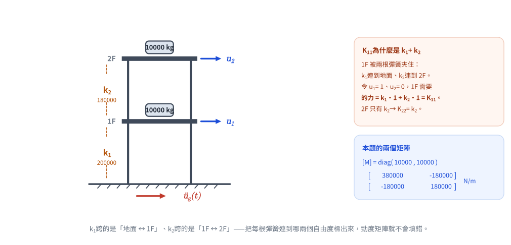
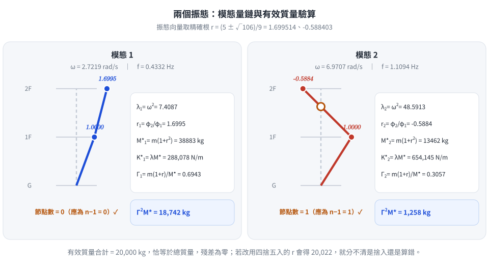
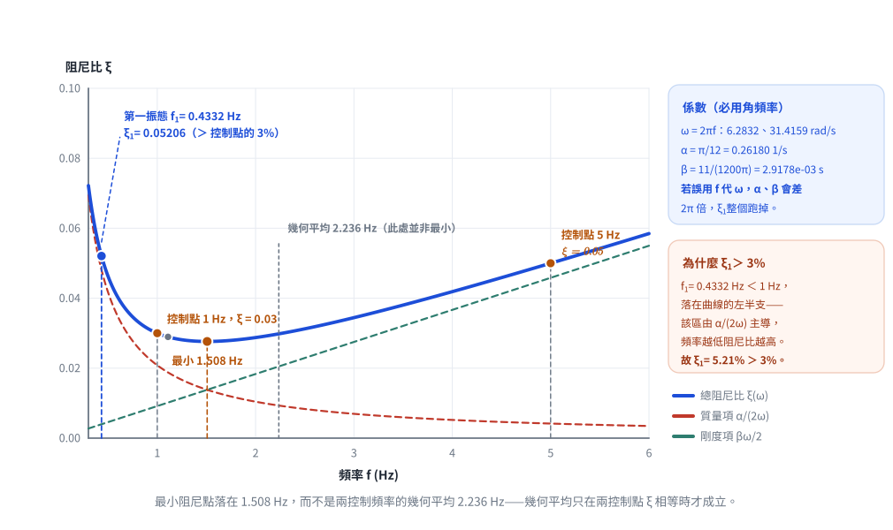

# 考題編號：SD-2023-2

**主分類：** `SD-U1-3` 單自由度、多自由度系統之動態分析及應用
**副分類：** `SD-U1-1` 結構動力基本性質及原理
**分析方法：** MDOF模態分析
**標籤：** `MDOF` `2自由度` `剪力建築` `特徵值問題` `自然頻率` `振態向量` `振態質量` `振態勁度` `振態參與因子` `Rayleigh阻尼` `比例阻尼` `阻尼比`

---

## 1. 原始題目重述

二層樓剪力建築（shear building），各樓層質量 $m_1 = m_2 = 10000$ kg，層間勁度：
- 1 樓（地面至 1F）：$k_1 = 200000$ N/m
- 2 樓（1F 至 2F）：$k_2 = 180000$ N/m

**子問題（一）（15分）：** 求質量矩陣、勁度矩陣、各振態頻率、振態向量、振態質量、振態勁度、振態參與因子。

**子問題（二）（10分）：** 依工程設計規範，頻率 1 Hz 時阻尼比 $\xi = 0.03$，5 Hz 時 $\xi = 0.05$，採 Rayleigh Damping $[C] = \alpha[M] + \beta[K]$，求 $\alpha, \beta$ 及本結構第一振態阻尼比。

---

## 2. 考題核心精神與出題者意圖

**核心觀念：** 此題是「MDOF 模態分析全流程」的標準題型，從矩陣建立、特徵值求解、模態量計算，到 Rayleigh 阻尼的應用——覆蓋結構動力學最核心的分析流程。

**出題者意圖：**
1. (一) 測驗剪力建築勁度矩陣的建立邏輯（注意 K₁₁ = k₁ + k₂，非單純 k₁）
2. (一) 測驗特徵值問題求解、振態量的定義與計算
3. (二) 測驗 Rayleigh 阻尼的兩方程式聯立，**強調頻率必須轉換為角頻率**（題目已明示此陷阱）

---

## 3. 解題戰略地圖與陷阱分析

**作戰計畫：**
1. 建立 [M]、[K]
2. 解特徵方程 det([K] − ω²[M]) = 0，得兩組 ω² → 提取振態向量
3. 計算振態質量 $M_n^* = \{φ\}_n^T[M]\{φ\}_n$、振態勁度 $K_n^* = \omega_n^2 M_n^*$、振態參與因子 $\Gamma_n$
4. 用兩控制點 (ω, ξ) 聯立方程解 α, β；再代入 ω₁ 求第一振態阻尼比

**關鍵陷阱：**

| # | 陷阱 | 應對策略 |
|---|------|---------|
| 1 | 勁度矩陣 $K_{11}$ 少算 | $K_{11} = k_1 + k_2$（2F 也拉著 1F），$K_{22} = k_2$，$K_{12} = -k_2$ |
| 2 | Rayleigh 阻尼用 Hz 而非 rad/s | 題目已明示：$\omega = 2\pi f$（rad/s），務必轉換 |
| 3 | 振態參與因子定義混淆 | 本題用 $\Gamma_i = \{φ\}^T_i[M]\{1\} / (\{φ\}^T_i[M]\{φ\}_i)$（地震輸入方向全為1） |
| 4 | 忘記驗算有效質量總和 | $\sum \Gamma_i^2 M_i^* = m_1+m_2$（等於總質量，可快速驗算） |

---

## 3.5 變數層次分析（Variable Hierarchy Analysis）

> 複習提示：第一次解題後，在每個卡住的知識點旁標記 `⚠`；第二次複習時只看有 `⚠` 的項目。

### 最終目標

`(一) 七大模態量；(二) α, β 及第一振態阻尼比 ξ₁`

### 本題關鍵公式（依計算順序）

$$\text{Step 1: } [K] = \begin{bmatrix} k_1+k_2 & -k_2 \\ -k_2 & k_2 \end{bmatrix},\quad [M] = \begin{bmatrix} m & 0 \\ 0 & m \end{bmatrix}$$

$$\text{Step 2: } \det\!\bigl([K]-\omega^2[M]\bigr) = 0 \Rightarrow \lambda^2 - 56\lambda + 360 = 0 \quad (\lambda = \omega^2)$$

$$\text{Step 3: } \lambda_{1,2} = 28 \mp 2\sqrt{106} \Rightarrow \omega_{1,2} = \sqrt{\lambda_{1,2}}$$

$$\text{Step 4: } \frac{\phi_{2i}}{\phi_{1i}} = \frac{K_{11} - \boxed{\lambda_i} m}{K_{12}} \quad \text{(由特徵向量方程求比例)}$$

$$\text{Step 5: } M_i^* = \{φ\}_i^T[M]\{φ\}_i,\quad K_i^* = \boxed{\omega_i}^2 M_i^*$$

$$\text{Step 6: } \Gamma_i = \frac{\{φ\}_i^T[M]\{1\}}{M_i^*}$$

$$\text{Step 7 (二): } \xi(\omega) = \frac{\alpha}{2\omega} + \frac{\beta\omega}{2},\quad \text{聯立兩控制點解 } \alpha, \beta$$

$$\text{Step 8 (二): } \xi_1 = \frac{\alpha}{2\boxed{\omega_1}} + \frac{\beta\boxed{\omega_1}}{2}$$

### L1：題目直接給定

| 符號 | 數值 | 說明 |
|------|------|------|
| $m_1 = m_2$ | 10000 kg | 各層樓板質量 |
| $k_1$ | 200000 N/m | 1F 層間勁度 |
| $k_2$ | 180000 N/m | 2F 層間勁度 |
| $\xi_{ref1}$ | 0.03 @ 1 Hz | Rayleigh 控制點1 |
| $\xi_{ref2}$ | 0.05 @ 5 Hz | Rayleigh 控制點2 |

### L2：需知識點推導

**Step 1：矩陣建立**

| 符號 | 公式／來源 | 卡關? |
|------|----------|:-----:|
| $K_{11}$ | $k_1 + k_2 = 380000$ N/m | |
| $K_{12}=K_{21}$ | $-k_2 = -180000$ N/m | |
| $K_{22}$ | $k_2 = 180000$ N/m | |

**Step 2-3：自然頻率**

| 符號 | 公式／來源 | 卡關? |
|------|----------|:-----:|
| 特徵方程 | $\lambda^2 - 56\lambda + 360 = 0$ | |
| $\lambda_1$ | $28 - 2\sqrt{106} = 7.409$ (rad/s)² | |
| $\lambda_2$ | $28 + 2\sqrt{106} = 48.591$ (rad/s)² | |
| $\omega_1$ | $\sqrt{7.409} = 2.722$ rad/s | |
| $\omega_2$ | $\sqrt{48.591} = 6.971$ rad/s | |

**Step 4：振態向量**

| 符號 | 公式／來源 | 卡關? |
|------|----------|:-----:|
| $r_1 = \phi_{21}/\phi_{11}$ | $(380000-74087)/180000 = 1.700$ | |
| $r_2 = \phi_{22}/\phi_{12}$ | $(380000-485913)/180000 = -0.588$ | |

**Step 5-6：振態量**

| 符號 | 公式／來源 | 卡關? |
|------|----------|:-----:|
| $M_1^*$ | $m(1+r_1^2) = 38883$ kg | |
| $M_2^*$ | $m(1+r_2^2) = 13462$ kg | |
| $K_1^*$ | $\lambda_1 M_1^* = 288078$ N/m | |
| $K_2^*$ | $\lambda_2 M_2^* = 654145$ N/m | |
| $\Gamma_1$ | $m(1+r_1)/M_1^* = 0.6943$ | |
| $\Gamma_2$ | $m(1+r_2)/M_2^* = 0.3057$ | |

**Step 7-8：Rayleigh 阻尼**

| 符號 | 公式／來源 | 卡關? |
|------|----------|:-----:|
| $\alpha$ | $\pi/12 \approx 0.2618$ rad/s | |
| $\beta$ | $11/(1200\pi) \approx 0.0029178$ s | |
| $\xi_1$ | $\alpha/(2\omega_1)+\beta\omega_1/2 \approx 0.05206$ | |

### L3：深層知識（不懂就卡住）

| 知識點 | 說明 | 卡關? |
|--------|------|:-----:|
| 剪力建築勁度矩陣的物理意義 | $K_{11}=k_1+k_2$：1F 受到 k₁（地面拉回）和 k₂（2F 拉回）兩個彈簧 | |
| Rayleigh 阻尼的頻率特性 | ξ(ω) 為雙曲線+直線的「U形」；α控制低頻段（大），β控制高頻段 | |
| 振態參與因子的物理意義 | 各模態對地震（{1}方向輸入）的參與程度；$\Gamma_i^2 M_i^*$ = 有效質量 | |
| 正規化選擇的任意性 | 振態向量可任意縮放，但振態質量、參與因子隨之改變；$\Gamma_i^2 M_i^*$ 不變 | |

---

## 4. 步驟化詳細計算過程

### 第(一)題：矩陣、頻率、振態量（15分）

#### 【1】質量矩陣與勁度矩陣

$$[M] = \begin{bmatrix} m_1 & 0 \\ 0 & m_2 \end{bmatrix} = \begin{bmatrix} 10000 & 0 \\ 0 & 10000 \end{bmatrix} \text{ (kg)}$$

剪力建築勁度矩陣（各自由度的平衡方程）：

$$[K] = \begin{bmatrix} k_1+k_2 & -k_2 \\ -k_2 & k_2 \end{bmatrix} = \begin{bmatrix} 380000 & -180000 \\ -180000 & 180000 \end{bmatrix} \text{ (N/m)}$$

*圖 1　題目重繪。把每根彈簧「跨在哪兩個自由度之間」標出來：$k_1$ 跨地面↔1F、$k_2$ 跨 1F↔2F，於是 1F 同時被兩根彈簧夾住，$K_{11} = k_1 + k_2$ 就不需要硬記。*

#### 【2】特徵值問題（自然頻率）

$$\det\!\bigl([K] - \lambda[M]\bigr) = 0, \quad \lambda = \omega^2$$

$$(380000 - 10000\lambda)(180000 - 10000\lambda) - (-180000)^2 = 0$$

展開整理後，除以 $10^8$：

$$\boxed{\lambda^2 - 56\lambda + 360 = 0}$$

解：
$$\lambda = \frac{56 \pm \sqrt{56^2 - 4 \times 360}}{2} = \frac{56 \pm \sqrt{1696}}{2} = 28 \pm 2\sqrt{106}$$

**驗算：** $\lambda_1 + \lambda_2 = 56$ ✓，$\lambda_1\lambda_2 = 360$ ✓

| 模態 | $\lambda_i = \omega_i^2$ (rad/s)² | $\omega_i$ (rad/s) | $f_i$ (Hz) |
|------|:----:|:----:|:----:|
| 模態 1 | $28 - 2\sqrt{106} = 7.409$ | $2.722$ | $0.433$ |
| 模態 2 | $28 + 2\sqrt{106} = 48.591$ | $6.971$ | $1.109$ |

#### 【3】振態向量

由 $([K] - \lambda_i[M])\{φ\}_i = \{0\}$ 的第一列，以 $\phi_{1i} = 1$ 正規化：

$$\frac{\phi_{2i}}{\phi_{1i}} = \frac{K_{11} - m\lambda_i}{K_{12}} = \frac{380000 - 10000\lambda_i}{180000}$$

**模態 1（$\lambda_1 = 7.409$）：**

$$r_1 = \frac{380000 - 74087}{180000} = \frac{305913}{180000} = \frac{5+\sqrt{106}}{9} \approx 1.700$$

$$\{φ\}_1 = \begin{bmatrix} 1 \\ 1.700 \end{bmatrix}$$（同向振動，一階模態）

**模態 2（$\lambda_2 = 48.591$）：**

$$r_2 = \frac{380000 - 485913}{180000} = \frac{-105913}{180000} = \frac{5-\sqrt{106}}{9} \approx -0.588$$

$$\{φ\}_2 = \begin{bmatrix} 1 \\ -0.588 \end{bmatrix}$$（反向振動，二階模態）

#### 【4】振態質量

$$M_n^* = \{φ\}_n^T[M]\{φ\}_n = m\sum_i \phi_{in}^2$$

以精確根 $r_1 = \dfrac{5+\sqrt{106}}{9} = 1.699514$、$r_2 = \dfrac{5-\sqrt{106}}{9} = -0.588403$ 代入：

$$M_1^* = 10000\,(1 + 1.699514^2) = 10000 \times 3.88835 = \boxed{38883 \text{ kg}}$$

$$M_2^* = 10000\,(1 + 0.588403^2) = 10000 \times 1.34622 = \boxed{13462 \text{ kg}}$$

> **為什麼要用精確根：** 若直接以四捨五入後的 $r_2 = -0.588$ 代入會得 $M_2^* = 13457$ kg，
> 誤差 0.04%；本身無妨，但後面的有效質量驗算（$\sum\Gamma_i^2 M_i^*$ 應恰為 20000 kg）
> 就會出現 0.1% 的殘差，讓人分不清是捨入還是算錯。**驗算式要能收斂到乾淨的數字，才有檢核價值。**

#### 【5】振態勁度

$$K_n^* = \omega_n^2 M_n^*$$

$$K_1^* = \lambda_1 M_1^* = 7.40874 \times 38883 = \boxed{288,078 \text{ N/m}}$$

$$K_2^* = \lambda_2 M_2^* = 48.59126 \times 13462 = \boxed{654,145 \text{ N/m}}$$

驗算（由矩陣直接計算 $K_1^* = \{φ\}_1^T[K]\{φ\}_1$）：

$$[K]\{φ\}_1 = \begin{bmatrix} 380000 - 180000 \times 1.699514 \\ -180000 + 180000 \times 1.699514 \end{bmatrix} = \begin{bmatrix} 74087 \\ 125913 \end{bmatrix}$$

$$K_1^* = 1 \times 74087 + 1.699514 \times 125913 = 74087 + 213991 = 288,078 \text{ N/m} \;\checkmark$$

（兩種算法完全吻合；若改用 $r_1 = 1.700$ 則得 288,200 N/m，差 0.04%，即截斷誤差。）

#### 【6】振態參與因子

$$\Gamma_i = \frac{\{φ\}_i^T[M]\{1\}}{M_i^*} = \frac{m\,(1 + r_i)}{M_i^*}$$

$$\Gamma_1 = \frac{10000\,(1 + 1.699514)}{38883} = \frac{26995}{38883} = \boxed{0.6943}$$

$$\Gamma_2 = \frac{10000\,(1 - 0.588403)}{13462} = \frac{4116}{13462} = \boxed{0.3057}$$

**有效質量驗算：**

$$\Gamma_1^2 M_1^* + \Gamma_2^2 M_2^* = 0.6943^2 \times 38883 + 0.3057^2 \times 13462$$

$$= 0.48195 \times 38883 + 0.09345 \times 13462 = 18742 + 1258 = \boxed{20000 \text{ kg}} \;\checkmark$$

（恰等於總質量 $m_1 + m_2 = 20000$ kg，殘差為零——這正是用精確根計算的好處。）

*圖 2　兩個振態與完整的模態量鏈。節點數（第 $n$ 振態 $n-1$ 個）與有效質量合計（須恰等於總質量）是兩道互相獨立的檢核；後者能收斂到乾淨的 20,000 kg，代表整條計算鏈都沒錯。*

---

### 第(二)題：Rayleigh 阻尼係數 α, β 及第一振態阻尼比（10分）

#### 【1】Rayleigh 阻尼公式

$$\xi(\omega) = \frac{\alpha}{2\omega} + \frac{\beta\omega}{2}$$

**注意：** 頻率單位必須為 **角頻率（rad/s）**，非 Hz！

*圖 3　Rayleigh 曲線與三個落點。$f_1 = 0.433$ Hz 落在曲線的**左半支**（$\alpha/(2\omega)$ 主導區），所以 $\xi_1$ 必然大於控制點的 3%；圖上同時標出最小點 1.508 Hz 與幾何平均 2.236 Hz——兩者不相等，因為本題兩控制點的 $\xi$ 並不相同。*

$$\omega_{ref1} = 2\pi \times 1 = 2\pi \approx 6.283 \text{ rad/s}, \quad \xi_{ref1} = 0.03$$

$$\omega_{ref2} = 2\pi \times 5 = 10\pi \approx 31.416 \text{ rad/s}, \quad \xi_{ref2} = 0.05$$

#### 【2】聯立方程

$$\frac{\alpha}{2 \cdot 2\pi} + \frac{\beta \cdot 2\pi}{2} = 0.03 \quad \Rightarrow \quad \frac{\alpha}{4\pi} + \pi\beta = 0.03 \tag{1}$$

$$\frac{\alpha}{2 \cdot 10\pi} + \frac{\beta \cdot 10\pi}{2} = 0.05 \quad \Rightarrow \quad \frac{\alpha}{20\pi} + 5\pi\beta = 0.05 \tag{2}$$

乘以 $4\pi$ 和 $20\pi$：

$$\alpha + 4\pi^2\beta = 0.12\pi \tag{1'}$$

$$\alpha + 100\pi^2\beta = \pi \tag{2'}$$

$(2') - (1')$：

$$96\pi^2\beta = 0.88\pi \quad \Rightarrow \quad \beta = \frac{0.88}{96\pi} = \frac{11}{1200\pi}$$

$$\boxed{\beta = \frac{11}{1200\pi} \approx 2.918 \times 10^{-3} \text{ s}}$$

代回 $(1')$：

$$\alpha = 0.12\pi - 4\pi^2 \times \frac{0.88}{96\pi} = 0.12\pi - \frac{3.52\pi}{96} = \pi\!\left(0.12 - \frac{11}{300}\right) = \frac{\pi}{12}$$

$$\boxed{\alpha = \frac{\pi}{12} \approx 0.2618 \text{ rad/s}}$$

**驗算：**
- @ $\omega = 2\pi$：$\xi = \frac{0.26180}{2\times6.2832} + \frac{0.0029178\times6.2832}{2} = 0.020833 + 0.009167 = 0.030000$ ✓
- @ $\omega = 10\pi$：$\xi = \frac{0.26180}{2\times31.416} + \frac{0.0029178\times31.416}{2} = 0.004167 + 0.045833 = 0.050000$ ✓

#### 【3】第一振態阻尼比

結構第一自然頻率 $\omega_1 = 2.722$ rad/s：

$$\xi_1 = \frac{\alpha}{2\omega_1} + \frac{\beta\omega_1}{2} = \frac{0.26180}{2\times2.7219} + \frac{0.0029178\times2.7219}{2}$$

$$= \frac{0.26180}{5.4438} + \frac{0.0079424}{2} = 0.048091 + 0.003971$$

$$\boxed{\xi_1 = 0.05206 \approx 5.21\%}$$

**物理解釋：** 結構第一自然頻率 $f_1 = 0.433$ Hz 低於控制點 1 Hz，位於 Rayleigh 阻尼曲線左側（α 主導的高阻尼區），故 $\xi_1 = 5.21\% > \xi_{ref1} = 3\%$，符合物理預期。

---

## 5. 關鍵爭議點與進階探討

**爭議點1：振態參與因子的定義**

部分教科書定義「Modal participation factor」為：
$$L_i = \{φ\}_i^T[M]\{1\}$$（不除以模態質量）

考場上需說明所用定義，本解析採**無因次化**版本 $\Gamma_i = L_i/M_i^*$。

**爭議點2：Rayleigh 阻尼的適用限制**

Rayleigh 阻尼假設阻尼力與質量和勁度成正比，實際結構阻尼更接近遲滯阻尼（材料阻尼），Rayleigh 阻尼僅在控制頻率附近精確，其餘頻段可能高估（低頻）或低估（高頻）阻尼。

**進階觀念：Rayleigh 阻尼曲線的最小值**

$\xi(\omega)$ 在 $\omega_{min} = \sqrt{\alpha/\beta}$ 時取最小值：

$$\omega_{min} = \sqrt{\frac{\pi/12}{11/(1200\pi)}} = \sqrt{\frac{\pi^2 \times 1200}{12 \times 11}} = \sqrt{\frac{100\pi^2}{11}} = \frac{10\pi}{\sqrt{11}} \approx 9.472 \text{ rad/s}$$

即最小阻尼點在 $f_{min} = 1.508$ Hz，落在控制點 1 Hz 和 5 Hz 之間，符合設計預期。

> ⚠ **不要記成「最小點在兩控制頻率的幾何平均」。** 幾何平均（本題為 $\sqrt{1\times5} = 2.236$ Hz）
> 只在兩控制點的阻尼比**相等**時才成立。本題 $\xi$ 由 3% 升到 5%，最小點被拉向阻尼比較低的
> 那一側，落在 1.508 Hz 而非 2.236 Hz。可與 [[SD-2025-3]]（$\zeta_1 = \zeta_3$，最小點恰為
> $\sqrt{\omega_1\omega_3}$）對照著記。

---

| 欄位 | 值 |
|------|----|
| verificationStatus | `unverified` |
| hasSolution | `true` |
| hasViz | `false` |

> **驗證狀態備註：** 2026-08-22 稽核。全部數值獨立復算：特徵方程、$\lambda_i$、$\omega_i$、$f_i$、
> 振態向量、$\alpha = \pi/12$、$\beta = 11/(1200\pi)$、$\xi_1$ 與 $\omega_{min}$ **均正確**。
> 本次修正的都是捨入與一致性問題：① 振態量改用精確根 $r_{1,2}=(5\pm\sqrt{106})/9$ 計算，
> 使有效質量驗算恰好收斂到 20000 kg（原為 20022，殘差來自 $r$ 的截斷）；
> ② $\Gamma_1$ 在 §3.5 表（0.6943）與 §4（0.6946）不一致，統一為 0.6943、$\Gamma_2$ 為 0.3057；
> ③ $\beta$ 由 2.919×10⁻³ 更正為 2.918×10⁻³、$\xi_1$ 由 0.05207 更正為 0.05206；
> ④ 移除指向不存在檔案的互動圖連結；⑤ 標題階層由 `###` 改為 `#`。
> **答案的有效位數結論不變。** 驗證狀態已重設，待人工重新驗算。

---

*圖解補繪：2026-08-22（向量圖 3 張，腳本 `gen_SD-2023-2.py`，所有數值由解題結果算出，可重跑）*
