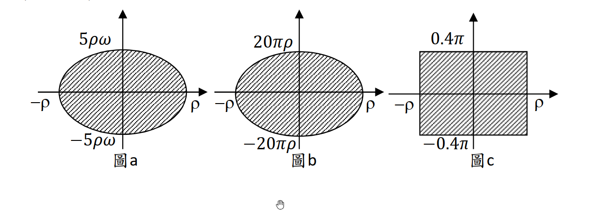
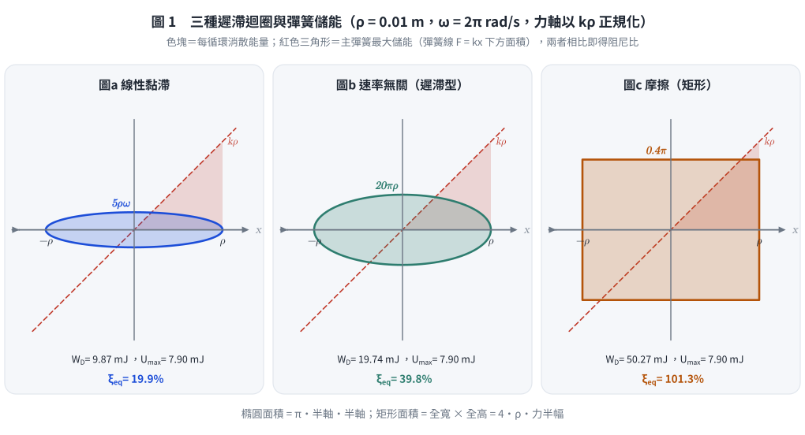
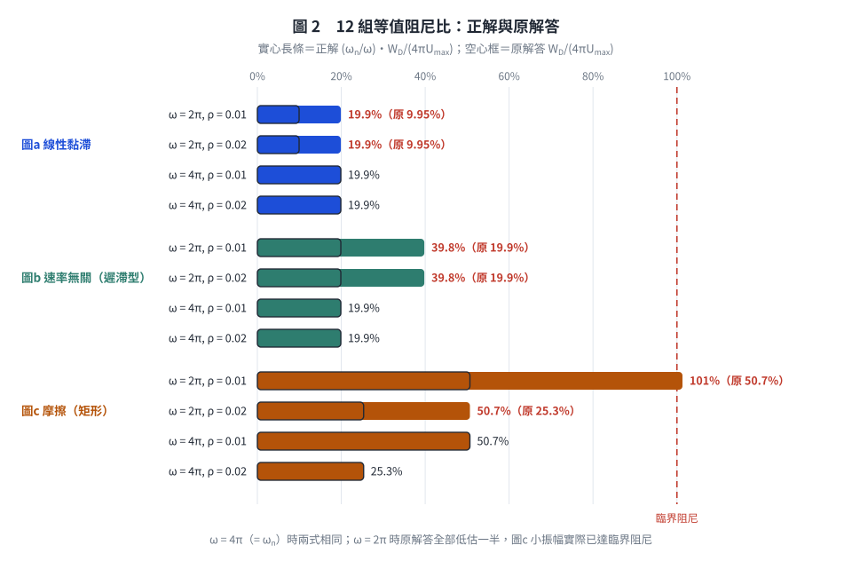
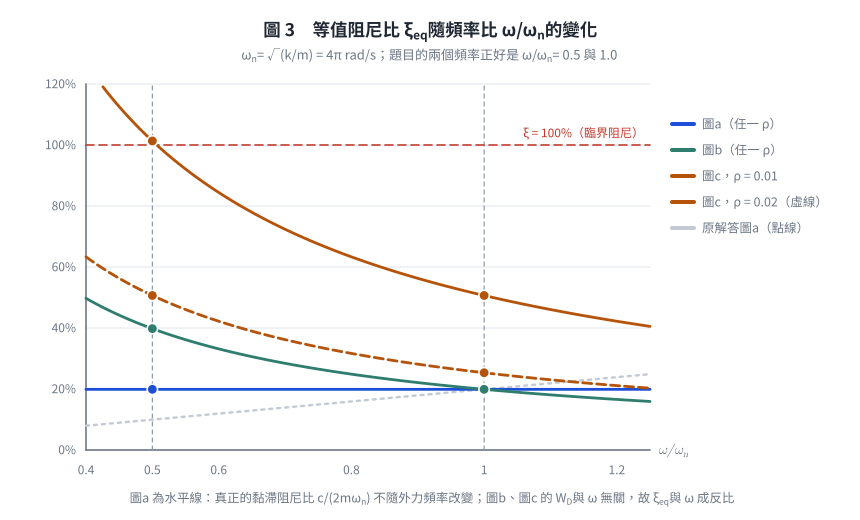

### 考題編號：SD-2023-4

**主分類：** `SD-U3-1` 結構耐震設計（含RC結構與鋼結構）
**副分類：** `SD-U3-2` 隔減震原理
**分析方法：** 消能減震分析（等值線性黏滯阻尼比）
**標籤：** `消能減震` `等效黏滯阻尼` `遲滯迴圈` `橢圓迴圈` `矩形迴圈` `等值阻尼比` `能量法` `黏滯阻尼器` `摩擦阻尼器` `耐震規範` `消能器安裝規定`

---

## 1. 原始題目重述

單自由度動力系統：$m = 1$ kg，$k = 16\pi^2$ N/m。

*圖說：圖a — 橢圓形遲滯迴圈，位移半幅 ρ，力半幅 5ρω（ω為振動角頻率）；圖b — 橢圓形遲滯迴圈，位移半幅 ρ，力半幅 20πρ（與頻率無關）；圖c — 矩形遲滯迴圈，位移半幅 ρ，力半幅 0.4π（常數，與振幅和頻率均無關）。力單位 N，長度單位 m。*

**子問題：**
- **(一)（15分）** 求三種消能器在 $\omega = 2\pi$ 及 $4\pi$ rad/s，振幅 $\rho = 0.01$ 及 $0.02$ m 共 12 種組合下的**等值線性黏滯阻尼比** $\xi_{eq}$。
- **(二)（10分）** 詳述最新建築物耐震設計規範中，消能減震技術的**數量、安裝位置及力量與位移規定**，並說明規定用意。

---

## 2. 考題核心精神與出題者意圖

**核心觀念：**
(一) 等值線性阻尼比的能量法公式 $\xi_{eq} = \dfrac{1}{4\pi}\cdot\dfrac{\omega_n}{\omega}\cdot\dfrac{W_D}{U_{max}}$（$\omega_n=\sqrt{k/m}=4\pi$；常見的簡化式 $W_D/(4\pi U_{max})$ 只在 $\omega=\omega_n$ 時成立），針對不同形狀的遲滯迴圈計算面積，代入求解。
(二) 規範對消能器的工程規定（冗餘性、位置效率、極限承載力）。

**出題者意圖：**
1. 測驗能否從圖形中**正確讀取遲滯迴圈面積**（橢圓、矩形面積公式）
2. 測驗對三種消能器物理特性的理解：圖a（線性黏滯，速率相關）、圖b（速率無關之遲滯型）、圖c（摩擦型）；兩個外力頻率刻意取 $\omega_n/2$ 與 $\omega_n$，考的是「哪一種的阻尼比會隨頻率變」
3. 測驗對台灣耐震規範消能減震章節的掌握程度

---

## 3. 解題戰略地圖與陷阱分析

**關鍵陷阱：**

| # | 陷阱 | 應對策略 |
|---|------|---------|
| 1 | 遲滯迴圈面積用錯形狀公式 | 橢圓面積 $= \pi ab$（非 $2ab$）；矩形面積 $= 4 \times$ 長 $\times$ 寬（半幅×半幅×4） |
| 2 | $U_{max}$ 的 $k$ 用錯 | $U_{max} = \frac{1}{2}k\rho^2$，此處 $k$ 是**系統勁度**（結構主彈簧 $k = 16\pi^2$），非消能器勁度 |
| 3 | 圖c的力不隨振幅變化 | 矩形高度 $= 0.4\pi$（常數），故 $W_D \propto \rho$；$\xi_{eq} \propto 1/(\rho\,\omega)$ |
| 4 | **漏掉頻率比 $\omega_n/\omega$** | 題目給 $m$ 就是要你算 $\omega_n = 4\pi$。$W_D/(4\pi U_{max})$ 只在共振時成立；任意 $\omega$ 下須乘 $\omega_n/\omega$。漏乘會讓 $\omega=2\pi$ 的 6 個答案全部低估一半 |
| 5 | 誤以為黏滯阻尼器的 $\xi$ 隨 $\omega$ 變 | 圖a 為 $c=5$ 的線性黏滯阻尼，$\xi = c/(2m\omega_n) = 5/(8\pi)$ 是固定值；會隨頻率變的是 $W_D$ 與 $\omega$ 無關的圖b、圖c |

**三種消能器物理對應：**

| 圖 | 迴圈形狀 | 力半幅 | 對應物理類型 | 阻尼比特性 |
|----|---------|--------|------------|-----------|
| 圖a | 橢圓 | $5\rho\omega$ | 線性黏滯阻尼器（$c=5$ N·s/m） | 常數 $5/(8\pi)$（與 $\omega$、$\rho$ 均無關） |
| 圖b | 橢圓 | $20\pi\rho$ | 速率無關之遲滯型（結構）阻尼，$W_D$ 與 $\omega$ 無關 | $\propto 1/\omega$，與 $\rho$ 無關 |
| 圖c | 矩形 | $0.4\pi$ | 摩擦（Coulomb）阻尼器 | $\propto 1/(\rho\,\omega)$ |

---

## 3.5 變數層次分析（Variable Hierarchy Analysis）

> 複習提示：第一次解題後，在每個卡住的知識點旁標記 `⚠`；第二次複習時只看有 `⚠` 的項目。

### 最終目標

`12 組 ξ_eq（圖a × 4 + 圖b × 4 + 圖c × 4）`

### 本題關鍵公式（依計算順序）

$$\text{Step 1: } U_{max} = \frac{1}{2}k\rho^2 = \frac{1}{2}(16\pi^2)\rho^2 = 8\pi^2\rho^2$$

$$\text{Step 2: } W_D = \text{遲滯迴圈面積（依圖形）}$$

$$\text{Step 3: } \omega_n = \sqrt{k/m} = 4\pi \text{ rad/s}$$

$$\text{Step 4: } \xi_{eq} = \frac{\omega_n}{\omega}\cdot\frac{W_D}{4\pi U_{max}} = \frac{4\pi}{\omega}\cdot\frac{W_D}{32\pi^3\rho^2}$$

| 圖 | 迴圈形狀 | 面積公式 |
|----|---------|---------|
| 圖a | 橢圓（半軸 $\rho$，$5\rho\omega$） | $W_D = \pi \cdot \rho \cdot 5\rho\omega = 5\pi\rho^2\omega$ |
| 圖b | 橢圓（半軸 $\rho$，$20\pi\rho$） | $W_D = \pi \cdot \rho \cdot 20\pi\rho = 20\pi^2\rho^2$ |
| 圖c | 矩形（半寬 $\rho$，半高 $0.4\pi$） | $W_D = 4 \cdot \rho \cdot 0.4\pi = 1.6\pi\rho$ |

### L1：題目直接給定

| 符號 | 數值 | 說明 |
|------|------|------|
| $m$ | 1 kg | 系統質量 |
| $k$ | $16\pi^2$ N/m | 系統勁度 |
| $\omega$ | $2\pi$ or $4\pi$ rad/s | 外力角頻率 |
| $\rho$ | 0.01 or 0.02 m | 振幅 |

### L2：需知識點推導

| 符號 | 公式／來源 | 卡關? |
|------|----------|:-----:|
| $U_{max}$ | $\frac{1}{2}(16\pi^2)\rho^2 = 8\pi^2\rho^2$ | |
| 橢圓面積公式 | $W = \pi ab$（$a,b$ 為半軸長） | |
| 矩形面積公式 | $W = \text{全寬} \times \text{全高} = 2\rho \times 2(0.4\pi)$ | |
| $\omega_n$ | $\sqrt{k/m} = 4\pi$ rad/s | |
| $\xi_{eq}$ | $(\omega_n/\omega)\,W_D/(4\pi U_{max})$ | |

### L3：深層知識（不懂就卡住）

| 知識點 | 說明 | 卡關? |
|--------|------|:-----:|
| 等值阻尼比的能量定義 | 等值黏滯阻尼在頻率 $\omega$ 下每循環消能 $\pi c_{eq}\omega\rho^2$，令等於 $W_D$ 得 $c_{eq}$，再由 $\xi_{eq}=c_{eq}/(2m\omega_n)$ 得 $\xi_{eq} = \frac{\omega_n}{\omega}\frac{W_D}{4\pi U_{max}}$（Chopra 式 3.9.2）；共振時才退化為 $W_D/(4\pi U_{max})$ | |
| 線性黏滯阻尼器的遲滯迴圈為橢圓 | $x=\rho\sin\omega t$，$F=c\rho\omega\cos\omega t$，$x^2/\rho^2+F^2/(c\rho\omega)^2=1$ | |
| 摩擦阻尼器的遲滯迴圈為矩形 | Coulomb 摩擦力大小恆定 $= \mu N$，故力不隨位移和速度變化 | |
| $U_{max}$ 用系統彈簧（非消能器勁度） | 等值阻尼比是相對於系統自身的彈性儲能，分母用 $k_{system}$ | |

---

## 4. 步驟化詳細計算過程

> 📊 互動圖：`SD-2023-4-hysteresis-viz.html`（三種迴圈的 $\xi_{eq}$ 互動計算器）

### 第(一)題：12 種等值線性黏滯阻尼比（15 分）

#### 核心公式

系統自然頻率：

$$\omega_n = \sqrt{\frac{k}{m}} = \sqrt{\frac{16\pi^2}{1}} = 4\pi \text{ rad/s}$$

等值黏滯阻尼在外力頻率 $\omega$ 下每循環消能 $\pi c_{eq}\,\omega\,\rho^2$，令其等於遲滯迴圈面積 $W_D$：

$$c_{eq} = \frac{W_D}{\pi\omega\rho^2}, \qquad \xi_{eq} = \frac{c_{eq}}{2m\omega_n} = \frac{1}{4\pi}\cdot\frac{\omega_n}{\omega}\cdot\frac{W_D}{U_{max}}, \qquad U_{max} = \frac{1}{2}k\rho^2 = 8\pi^2\rho^2$$

> 簡化式 $W_D/(4\pi U_{max})$ 是 $\omega = \omega_n$ 時的特例。本題 $\omega = 2\pi = \omega_n/2$ 時，$\omega_n/\omega = 2$，不可省略。

*圖 1　三種遲滯迴圈與彈簧儲能。色塊是 $W_D$，紅色三角形是 $U_{max}$，兩者都畫在同一把力尺上。可以攔下兩種錯誤：橢圓面積誤用 $2ab$ 或矩形漏乘 4，以及把 $U_{max}$ 誤算成消能器自身的儲能（$U_{max}$ 屬於彈簧線 $F=kx$，不屬於迴圈）。*

---

#### 圖a：橢圓迴圈，力半幅 $= 5\rho\omega$（線性黏滯阻尼器，$c=5$ N·s/m）

$$W_D^{(a)} = \pi \cdot \rho \cdot 5\rho\omega = 5\pi\rho^2\omega$$

$$\xi_{eq}^{(a)} = \frac{1}{4\pi}\cdot\frac{4\pi}{\omega}\cdot\frac{5\pi\rho^2\omega}{8\pi^2\rho^2} = \frac{5}{8\pi}$$

**$\omega$ 與 $\rho$ 都相消。** 這正是線性黏滯阻尼器的本質：$\xi = c/(2m\omega_n) = 5/(2\cdot1\cdot4\pi) = 5/(8\pi)$，與外力頻率無關。

| 外力頻率 $\omega$ | 振幅 $\rho$ | $W_D^{(a)}$ (J) | $\xi_{eq}^{(a)}$ |
|:---:|:---:|:---:|:---:|
| $2\pi$ rad/s | 0.01 m | $10^{-3}\pi^2$ | $\dfrac{5}{8\pi} \approx \mathbf{19.9\%}$ |
| $2\pi$ rad/s | 0.02 m | $4\times10^{-3}\pi^2$ | $\dfrac{5}{8\pi} \approx \mathbf{19.9\%}$ |
| $4\pi$ rad/s | 0.01 m | $2\times10^{-3}\pi^2$ | $\dfrac{5}{8\pi} \approx \mathbf{19.9\%}$ |
| $4\pi$ rad/s | 0.02 m | $8\times10^{-3}\pi^2$ | $\dfrac{5}{8\pi} \approx \mathbf{19.9\%}$ |

$$\boxed{\xi_{eq}^{(a)} = \frac{5}{8\pi} \approx 19.9\% \quad \text{（四種組合均相同）}}$$

---

#### 圖b：橢圓迴圈，力半幅 $= 20\pi\rho$（速率無關之遲滯型阻尼）

$$W_D^{(b)} = \pi \cdot \rho \cdot 20\pi\rho = 20\pi^2\rho^2 \quad\text{（與 } \omega \text{ 無關）}$$

$$\xi_{eq}^{(b)} = \frac{1}{4\pi}\cdot\frac{4\pi}{\omega}\cdot\frac{20\pi^2\rho^2}{8\pi^2\rho^2} = \frac{5}{2\omega}$$

**$\rho$ 相消，$\xi_{eq}^{(b)}$ 與 $\omega$ 成反比。**

| 外力頻率 $\omega$ | 振幅 $\rho$ | $W_D^{(b)}$ (J) | $\xi_{eq}^{(b)}$ |
|:---:|:---:|:---:|:---:|
| $2\pi$ rad/s | 0.01 m | $2\times10^{-3}\pi^2$ | $\dfrac{5}{4\pi} \approx \mathbf{39.8\%}$ |
| $2\pi$ rad/s | 0.02 m | $8\times10^{-3}\pi^2$ | $\dfrac{5}{4\pi} \approx \mathbf{39.8\%}$ |
| $4\pi$ rad/s | 0.01 m | $2\times10^{-3}\pi^2$ | $\dfrac{5}{8\pi} \approx \mathbf{19.9\%}$ |
| $4\pi$ rad/s | 0.02 m | $8\times10^{-3}\pi^2$ | $\dfrac{5}{8\pi} \approx \mathbf{19.9\%}$ |

---

#### 圖c：矩形迴圈，力半幅 $= 0.4\pi$（摩擦阻尼器，Coulomb 型）

$$W_D^{(c)} = 2\rho \times 2(0.4\pi) = 1.6\pi\rho$$

$$\xi_{eq}^{(c)} = \frac{1}{4\pi}\cdot\frac{4\pi}{\omega}\cdot\frac{1.6\pi\rho}{8\pi^2\rho^2} = \frac{0.2}{\pi\,\omega\,\rho}$$

**$\xi_{eq}^{(c)}$ 同時與 $\omega$、$\rho$ 成反比。**

| 外力頻率 $\omega$ | 振幅 $\rho$ | $W_D^{(c)}$ (J) | $\xi_{eq}^{(c)}$ |
|:---:|:---:|:---:|:---:|
| $2\pi$ rad/s | 0.01 m | $0.016\pi$ | $\dfrac{10}{\pi^2} \approx \mathbf{101\%}$ |
| $2\pi$ rad/s | 0.02 m | $0.032\pi$ | $\dfrac{5}{\pi^2} \approx \mathbf{50.7\%}$ |
| $4\pi$ rad/s | 0.01 m | $0.016\pi$ | $\dfrac{5}{\pi^2} \approx \mathbf{50.7\%}$ |
| $4\pi$ rad/s | 0.02 m | $0.032\pi$ | $\dfrac{2.5}{\pi^2} \approx \mathbf{25.3\%}$ |

---

#### 匯總表（12 種組合）

| 消能器 | $\omega=2\pi$, $\rho=0.01$ | $\omega=2\pi$, $\rho=0.02$ | $\omega=4\pi$, $\rho=0.01$ | $\omega=4\pi$, $\rho=0.02$ |
|:----:|:----:|:----:|:----:|:----:|
| **圖a**（線性黏滯） | $5/(8\pi) \approx \mathbf{19.9\%}$ | $5/(8\pi) \approx \mathbf{19.9\%}$ | $5/(8\pi) \approx \mathbf{19.9\%}$ | $5/(8\pi) \approx \mathbf{19.9\%}$ |
| **圖b**（速率無關） | $5/(4\pi) \approx \mathbf{39.8\%}$ | $5/(4\pi) \approx \mathbf{39.8\%}$ | $5/(8\pi) \approx \mathbf{19.9\%}$ | $5/(8\pi) \approx \mathbf{19.9\%}$ |
| **圖c**（摩擦型） | $10/\pi^2 \approx \mathbf{101\%}$ | $5/\pi^2 \approx \mathbf{50.7\%}$ | $5/\pi^2 \approx \mathbf{50.7\%}$ | $2.5/\pi^2 \approx \mathbf{25.3\%}$ |

*圖 2　12 組 $\xi_{eq}$ 的正解與簡化式比較。$\omega = 4\pi$ 這一列兩式完全重合，$\omega = 2\pi$ 這一列簡化式全部只有一半。可以攔下「漏乘 $\omega_n/\omega$」的錯誤，也能看出圖c 在小振幅、低頻時已超過臨界阻尼，等值線性化不再適用。*

**規律總結：**
- 圖a（黏滯型）：$\xi_{eq}$ 為**常數**，與 $\omega$ 和 $\rho$ 均無關，因為 $W_D \propto \omega$ 剛好抵消 $\omega_n/\omega$
- 圖b（速率無關型）：$W_D$ 與 $\omega$ 無關，故 $\xi_{eq} \propto 1/\omega$，與 $\rho$ 無關
- 圖c（摩擦型）：$W_D \propto \rho$，故 $\xi_{eq} \propto 1/(\rho\,\omega)$，小振幅、低頻時最大
- 命題者刻意讓三者在 $\omega = \omega_n$ 時，圖a 與圖b 相等（$5/(8\pi)$），用來對比「速率相關」與「速率無關」兩種消能機制

*圖 3　$\xi_{eq}$ 隨 $\omega/\omega_n$ 的變化，題目的 12 個點都落在曲線上。可以攔下「黏滯阻尼器的 $\xi$ 隨 $\omega$ 增大」這個錯誤：灰色點線就是簡化式算出的圖a，在 $\omega \neq \omega_n$ 時明顯偏離真正的水平線。*

---

### 第(二)題：消能減震規範規定（10 分）

> ⚠ **待查證**：以下條目（數量下限、力量放大係數 1.3、溫度範圍等）尚未附上《建築物耐震設計規範》消能減震章節的條號，部分寫法接近 ASCE 7 第 18 章。定稿前請逐條對照現行規範原文並補上條號。

#### 【一】消能器數量規定

依《建築物耐震設計規範》消能減震設計章節：

1. **冗餘性要求**：消能器不得集中設置，應分散配置，確保**單一消能器失效後，系統仍具足夠消能能力**（冗餘性原則）
2. **附加阻尼目標**：消能系統提供的附加等效阻尼比，須足以使結構總有效阻尼比達到設計目標（通常不低於 5%，依設計需求而定）
3. **每一主方向均應配置**：兩個主要水平方向各自配置足夠的消能器，不得僅在單方向設置

**規定用意：** 避免單點失效導致消能系統完全喪失功能；確保地震力在兩個主要方向均可有效消散。

#### 【二】安裝位置規定

1. **層間位移優先原則**：消能器應安裝於**層間相對位移（或速度）較大的樓層及位置**，以最大化消能效率（如底部數層或受力較大的軟弱層）
2. **平面對稱性要求**：消能器平面配置應**盡量對稱**，避免因消能器不對稱導致結構扭轉效應加劇
3. **立面連續性要求**：宜沿建築高度**連續且均勻配置**，避免過大的立面不規則性（如集中在某幾層）
4. **不阻礙逃生路線**：消能器的安裝位置及連桿，不得阻礙正常使用及地震後的緊急疏散
5. **與主體結構整合**：消能器及其連桿安裝後，不得改變建築物的基本結構形式或導致局部應力集中

**規定用意：** 在消能效率最高的位置發揮最大效益；避免因配置不當引入新的結構弱點。

#### 【三】消能器力量與位移規定

1. **設計位移容量**：
   - 消能器的**最大允許位移** $\geq$ **最大考量地震（MCE）下計算所得最大位移** × 安全係數（通常 $\geq 1.0$ 倍）
   - 設計時採 MCE（而非設計地震 DBE），確保在極端地震下消能器不先行損壞

2. **設計力量容量**：
   - 消能器本體及其**連接構件（連桿、接頭、銷釘）**的設計力量 $\geq$ 消能器在最大位移下出力 × **放大係數 $\Omega$ = 1.3**（或規範指定值）
   - 此放大係數考慮動態效應、材料超強（overstrength）及不確定性

3. **溫度效應**（黏滯阻尼器特定要求）：
   - 黏滯阻尼器的阻尼力會受溫度影響，設計時需提供**溫度修正因子**，確認在台灣氣候範圍（$0\sim50°$C）內性能不超出設計範圍

4. **耐久性與可更換性**：
   - 消能器設計使用年限內應能正常運作
   - 地震後如消能器損壞，應**可獨立更換**，不需拆除主體結構

**規定用意：**
- **位移容量 ≥ MCE 位移**：確保消能器在最大地震下不損壞，仍能提供消能功能，不對主結構造成額外負擔
- **力量放大係數**：消能器連接是消能系統最薄弱的環節，若連接先壞，消能器即失效；放大係數確保連接強度高於消能器本體，符合「強連接、弱消能器」的容量設計原則
- **可更換性**：消能器屬於「犧牲性」元件，設計目的就是讓消能器代替主結構損耗能量；賦予可更換性，使建築物地震後能快速恢復使用，降低社會經濟損失

---

## 5. 關鍵爭議點與進階探討

**爭議點1：$U_{max}$ 應用消能器勁度還是系統勁度？**

當消能器含有彈性勁度分量（如黏彈性阻尼器），系統總勁度 $k_{total} = k + k_d$，嚴格應以 $k_{total}$ 計算 $U_{max}$。但本題消能器的彈性分量未明確給出，且題目給定的系統勁度 $k = 16\pi^2$ 即為主彈簧，**計算等值阻尼比時 $U_{max}$ 用主彈簧 $k$ 計算**（假設消能器為純消能元件，無彈性儲能）。

**爭議點2：摩擦阻尼器的「等值」概念限制**

摩擦阻尼器（圖c）在 $\omega=2\pi$、$\rho=0.01$ 時 $\xi_{eq} = 10/\pi^2 \approx 101\%$，已超過臨界阻尼。等值線性化假設系統仍以穩態簡諧振動，$\xi_{eq} \geq 1$ 時這個前提已不成立（摩擦力 $0.4\pi \approx 1.26$ N 接近彈簧力 $k\rho \approx 1.58$ N，甚至可能出現黏滯不動），此時數值只能當作比較指標，需改用非線性時間歷程分析。

**爭議點3：簡化式 $W_D/(4\pi U_{max})$ 何時可用？**

規範（如 FEMA、ASCE 7）的等效阻尼 $\beta = W_D/(4\pi E_S)$ 是以結構在自身週期附近振動為前提，等同於取 $\omega=\omega_n$。本題明確給定外力頻率且 $\omega \neq \omega_n$，必須用完整式。判斷方法：題目若給 $m$、$k$ 且外力頻率不等於 $\omega_n$，就要乘 $\omega_n/\omega$。

**進階觀念：消能器效率比較**

| 類型 | $\xi_{eq}$ 特性 | 優點 | 缺點 |
|------|----------------|------|------|
| 線性黏滯（圖a） | 常數 $c/(2m\omega_n)$ | 阻尼比穩定、不隨振幅頻率變；力與位移相差 90°，不增加最大內力 | 需注意漏油、溫度對 $c$ 的影響 |
| 速率無關遲滯型（圖b） | $\propto 1/\omega$ | 每循環消能固定，低頻（長週期）時效果相對較高 | 實際黏彈性材料受溫度、頻率影響大 |
| 摩擦型（圖c） | $\propto 1/(\rho\,\omega)$ | 結構簡單，成本低；小振幅時等值阻尼比高 | 力量需超過起滑力才作動；大振幅時效果遞減 |

---

*圖解補繪：2026-10-05（向量圖，腳本 `gen_SD-2023-4.py`，可重跑）　｜　第(一)題修正：補上頻率比 $\omega_n/\omega$*
