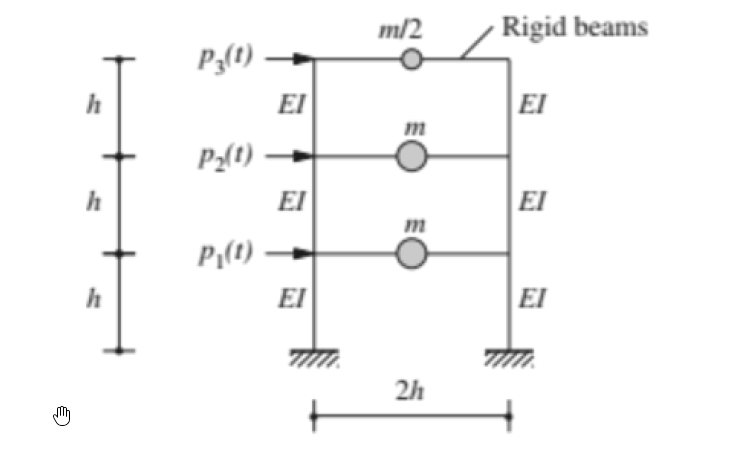

# 考題編號：SD-2024-1

**主分類：** `SD-U1-3` 單自由度、多自由度系統之動態分析及應用
**副分類：** `SD-U1-2` 運動方程式推導
**分析方法：** MDOF模態分析
**標籤：** `MDOF` `3自由度` `剪力屋架` `特徵值問題` `自然頻率` `模態向量` `正規化` `模態參與質量` `有效質量` `質量驗證`

---

## 1. 原始題目重述 (Problem Restatement)

**結構系統：** 三層樓剪力屋架（Shear Frame），剛性樓板假設

**幾何與材料條件：**
- 各層柱高：h（共三層，總高 3h）
- 各層框架寬：2h
- 各層柱截面彎曲勁度：EI（每層各兩根柱）
- 樓板（梁）假設為剛性（Rigid beams）

**質量分布：**
- 第 1、2 樓板質量：m（各樓層）
- 屋頂（3F）質量：m/2

**外力：**
- 各樓層側向激振力：$p_1(t)$、$p_2(t)$、$p_3(t)$

*圖說：三層剪力屋架，Rigid beams，各層兩根 EI 柱，層高 h，框寬 2h。質量：屋頂 m/2，1F 及 2F 各 m。側向外力由下而上為 p₁(t)、p₂(t)、p₃(t)。*

**各子問題：**
- (一) 推導運動方程式（3分）
- (二) 求三個模態之模態頻率（3分）
- (三) 對 3F 正規化及對模態質量正規化之模態向量，說明差異（7分）
- (四) 三個模態之模態參與質量、參與百分比，並驗證總和等於總質量（12分）

---

## 2. 考題核心精神與出題者意圖 (Core Concepts & Examiner's Intent)

**核心觀念：** 三自由度剪力屋架的完整模態分析流程。

**出題者測驗的能力：**
1. 能否正確建立剪力屋架的 $[M]$、$[K]$ 矩陣（特別注意不等質量分配）
2. 能否求解 $3\times3$ 特徵值問題（含代入有理根定理）
3. 兩種正規化的物理意義是否清楚
4. 模態參與質量（Effective Modal Mass）計算及驗證

**主要陷阱：** 屋頂質量為 m/2（非 m），若漏掉此差異將導致整道題全錯。

---

## 3. 解題戰略地圖與陷阱分析 (Strategic Roadmap & Trap Analysis)

**作戰計畫：**
1. 計算各層剪力勁度 → 建立 [K]
2. 建立 [M]（注意 m₃ = m/2）
3. 求特徵多項式 → 解出 λ₁, λ₂, λ₃ → 換算 ω₁, ω₂, ω₃
4. 逐模態代回求振態向量
5. 執行兩種正規化
6. 計算模態參與因子 Γᵢ → 有效質量 mᵢ* → 驗證加總

**關鍵陷阱：**

| # | 陷阱 | 應對 |
|---|------|------|
| 1 | m₃ = m/2（非 m） | 看圖仔細確認每層質量標示 |
| 2 | 層勁度計算：固定端柱 k = 12EI/h³，兩根合計 24EI/h³ | 剛性梁→雙固端假設 |
| 3 | 特徵多項式有理根試驗順序 | 先試 λ=2，可消去一次因式 |
| 4 | 模態參與質量 ≠ 模態質量；mᵢ* = Γᵢ²·Mᵢ = Lᵢ²/Mᵢ | 注意公式定義 |

---

## 3.5 變數層次分析 (Variable Hierarchy Analysis)

> 複習提示：卡住的知識點旁標記 `⚠`；第二次複習時只看有 `⚠` 的項目。

### 最終目標
求三個模態之模態參與質量 $m_i^*$，驗證 $\sum m_i^* = m_{total}$

### 本題關鍵公式（依計算順序）

$$k = \frac{24EI}{h^3} \quad \text{（每層剪力勁度）}$$

$$[K]\{\phi\} = \omega^2[M]\{\phi\} \quad \text{（特徵值問題）}$$

$$\det\!\left([K] - \omega^2[M]\right) = 0 \quad \text{（特徵方程式）}$$

$$\lambda^3 - 6\lambda^2 + 9\lambda - 2 = 0 \quad \text{（令 } \lambda = \omega^2 m/k \text{）}$$

$$\Gamma_i = \frac{\{{\phi}\}_i^T [M]\{1\}}{\{{\phi}\}_i^T [M]\{{\phi}\}_i} = \frac{L_i}{M_i} \quad \text{（模態參與因子）}$$

$$m_i^* = \Gamma_i^2 M_i = \frac{L_i^2}{M_i} \quad \text{（模態有效質量）}$$

$$\sum_{i=1}^{3} m_i^* = m_{total} \quad \text{（驗證）}$$

### L1：題目直接給定

| 符號 | 數值 | 說明 |
|------|------|------|
| $m_1, m_2$ | $m$ | 第1、2層質量 |
| $m_3$ | $m/2$ | 屋頂質量 |
| $EI$ | $EI$ | 各柱彎曲勁度 |
| $h$ | $h$ | 各層層高 |
| 每層柱數 | 2 | 由圖形讀取 |

### L2：需知識點推導

**層勁度計算**

| 符號 | 公式／來源 | 卡關? |
|------|-----------|-------|
| $k_{col}$ | $12EI/h^3$（雙固端柱側移勁度） | |
| $k$ | $2 \times k_{col} = 24EI/h^3$（每層兩柱並聯） | |

**矩陣建立**

| 符號 | 公式／來源 | 卡關? |
|------|-----------|-------|
| $[M]$ | $\mathrm{diag}(m,\, m,\, m/2)$ | |
| $[K]$ | 三對角剪力勁度矩陣，見§4 | |

**特徵值求解**

| 符號 | 公式／來源 | 卡關? |
|------|-----------|-------|
| $\lambda$ | $\omega^2 m/k$（無因次化） | |
| $\lambda_1$ | $2 - \sqrt{3}$ | |
| $\lambda_2$ | $2$ | |
| $\lambda_3$ | $2 + \sqrt{3}$ | |

**模態參與質量**

| 符號 | 公式／來源 | 卡關? |
|------|-----------|-------|
| $L_i$ | $\{\phi\}_i^T[M]\{1\}$ | |
| $M_i$ | $\{\phi\}_i^T[M]\{\phi\}_i$（模態質量） | |
| $m_i^*$ | $L_i^2/M_i$ | |

### L3：深層知識（不懂就卡住）

| 知識點 | 說明 | 卡關? |
|--------|------|-------|
| 雙固端柱假設 | 剛性梁→柱兩端均固定→側移勁度 $12EI/h^3$（非懸臂 $3EI/h^3$） | |
| 特徵多項式求根 | 先用有理根定理試 $\lambda=1,2$；再用因式分解求餘根 | |
| 正規化差異 | 對某自由度正規化→比較振態形狀；對模態質量正規化→使 $M_i=1$，方便解耦 | |
| 有效質量 vs 模態質量 | $M_i = \{\phi\}^T[M]\{\phi\}$（模態質量）；$m_i^* = L_i^2/M_i$（有效質量，代表該模態對地震反應的質量貢獻） | |

---

## 4. 步驟化詳細計算過程 (Step-by-Step Detailed Calculation)

> 📊 互動圖：`SD-2024-1-modal-viz.html`

### Step 0：定義座標與勁度

**自由度定義：**
$$x_1 = \text{1F 側移},\quad x_2 = \text{2F 側移},\quad x_3 = \text{3F（屋頂）側移}$$

**各層剪力勁度**（剛性梁→雙固端柱）：

$$k = 2 \times \frac{12EI}{h^3} = \frac{24EI}{h^3}$$

三層勁度相同，令 $k = \dfrac{24EI}{h^3}$。

---

### Step 1：建立質量矩陣 $[M]$ 與勁度矩陣 $[K]$

$$[M] = \begin{bmatrix} m & 0 & 0 \\ 0 & m & 0 \\ 0 & 0 & m/2 \end{bmatrix}$$

$$[K] = k\begin{bmatrix} 2 & -1 & 0 \\ -1 & 2 & -1 \\ 0 & -1 & 1 \end{bmatrix}$$

*策略註解：$K_{33}=k$（第3層只有一層勁度），$K_{11}=K_{22}=2k$（上下各一層）。*

---

### Step 1.5：運動方程式（一）

$$\boxed{[M]\{\ddot{x}\} + [K]\{x\} = \{p(t)\}}$$

展開式（以 $k = 24EI/h^3$ 表示）：

$$\begin{bmatrix} m & & \\ & m & \\ & & m/2 \end{bmatrix}\begin{Bmatrix}\ddot{x}_1\\\ddot{x}_2\\\ddot{x}_3\end{Bmatrix} + k\begin{bmatrix}2&-1&0\\-1&2&-1\\0&-1&1\end{bmatrix}\begin{Bmatrix}x_1\\x_2\\x_3\end{Bmatrix} = \begin{Bmatrix}p_1(t)\\p_2(t)\\p_3(t)\end{Bmatrix}$$

---

### Step 2：求特徵方程式（二）

令 $\lambda = \dfrac{\omega^2 m}{k}$，特徵值問題化為：

$$\det\!\left(\begin{bmatrix}2-\lambda & -1 & 0 \\ -1 & 2-\lambda & -1 \\ 0 & -1 & 1-\lambda/2\end{bmatrix}\right) = 0$$

展開行列式：

$$= (2-\lambda)\left[(2-\lambda)\left(1-\frac{\lambda}{2}\right) - 1\right] - \left(1-\frac{\lambda}{2}\right)$$

計算中間項 $(2-\lambda)(1-\lambda/2) = 2 - 2\lambda + \lambda^2/2$，代入：

$$= (2-\lambda)\left(1 - 2\lambda + \frac{\lambda^2}{2}\right) - \left(1-\frac{\lambda}{2}\right)$$

展開並整理：

$$1 - \frac{9\lambda}{2} + 3\lambda^2 - \frac{\lambda^3}{2} = 0$$

乘以 $-2$：

$$\boxed{\lambda^3 - 6\lambda^2 + 9\lambda - 2 = 0}$$

**求根：** 試 $\lambda = 2$：$8 - 24 + 18 - 2 = 0$ ✓

因式分解：

$$(\lambda - 2)(\lambda^2 - 4\lambda + 1) = 0$$

$$\lambda_{1,3} = \frac{4 \pm \sqrt{12}}{2} = 2 \pm \sqrt{3}$$

| 模態 | $\lambda_i = \omega_i^2 m/k$ | 精確值 | 近似值 |
|------|-----|--------|--------|
| 1 | $2 - \sqrt{3}$ | $\approx 0.268$ | 最低頻 |
| 2 | $2$ | $= 2.000$ | 中頻 |
| 3 | $2 + \sqrt{3}$ | $\approx 3.732$ | 最高頻 |

**模態圓頻率（二）：**

$$\boxed{\omega_1 = \sqrt{\frac{(2-\sqrt{3})\,k}{m}} = \sqrt{\frac{(2-\sqrt{3}) \cdot 24EI}{mh^3}}}$$

$$\boxed{\omega_2 = \sqrt{\frac{2k}{m}} = \sqrt{\frac{48EI}{mh^3}}}$$

$$\boxed{\omega_3 = \sqrt{\frac{(2+\sqrt{3})\,k}{m}} = \sqrt{\frac{(2+\sqrt{3}) \cdot 24EI}{mh^3}}}$$

---

### Step 3：求各模態振態向量

代回 $([K] - \omega_i^2[M])\{\phi\}_i = \{0\}$，令第1自由度 $\phi_{1i} = 1$。

**模態 1（$\lambda_1 = 2-\sqrt{3}$）：**

- Row 1：$\sqrt{3}\,\phi_1 - \phi_2 = 0 \Rightarrow \phi_2 = \sqrt{3}$
- Row 3：$-\phi_2 + \dfrac{\sqrt{3}}{2}\phi_3 = 0 \Rightarrow \phi_3 = \dfrac{2\phi_2}{\sqrt{3}} = 2$

$$\{\phi\}_1 = \begin{Bmatrix}1\\\sqrt{3}\\2\end{Bmatrix}$$

**模態 2（$\lambda_2 = 2$）：**

- Row 1：$0 \cdot \phi_1 - \phi_2 = 0 \Rightarrow \phi_2 = 0$
- Row 2：$-\phi_1 + 0 - \phi_3 = 0 \Rightarrow \phi_3 = -1$

$$\{\phi\}_2 = \begin{Bmatrix}1\\0\\-1\end{Bmatrix}$$

**模態 3（$\lambda_3 = 2+\sqrt{3}$）：**

- Row 1：$-\sqrt{3}\,\phi_1 - \phi_2 = 0 \Rightarrow \phi_2 = -\sqrt{3}$
- Row 3：$\phi_2\cdot(-1) + (-\sqrt{3}/2)\phi_3 = 0 \Rightarrow \phi_3 = 2$

$$\{\phi\}_3 = \begin{Bmatrix}1\\-\sqrt{3}\\2\end{Bmatrix}$$

---

### Step 4：兩種正規化（三）

#### A. 對 3F 正規化（令 $\phi_{3i} = 1$）

將各振態向量除以其第3分量：

$$\{\phi\}_1^{(3F)} = \frac{1}{2}\begin{Bmatrix}1\\\sqrt{3}\\2\end{Bmatrix} = \begin{Bmatrix}1/2\\\sqrt{3}/2\\1\end{Bmatrix}$$

$$\{\phi\}_2^{(3F)} = \frac{1}{-1}\begin{Bmatrix}1\\0\\-1\end{Bmatrix} = \begin{Bmatrix}-1\\0\\1\end{Bmatrix}$$

$$\{\phi\}_3^{(3F)} = \frac{1}{2}\begin{Bmatrix}1\\-\sqrt{3}\\2\end{Bmatrix} = \begin{Bmatrix}1/2\\-\sqrt{3}/2\\1\end{Bmatrix}$$

#### B. 對模態質量正規化（令 $\{\tilde{\phi}\}_i^T[M]\{\tilde{\phi}\}_i = 1$）

計算各模態質量 $M_i = \{\phi\}_i^T[M]\{\phi\}_i$：

$$M_1 = m(1)^2 + m(\sqrt{3})^2 + \frac{m}{2}(2)^2 = m + 3m + 2m = 6m$$

$$M_2 = m(1)^2 + m(0)^2 + \frac{m}{2}(-1)^2 = m + 0 + \frac{m}{2} = \frac{3m}{2}$$

$$M_3 = m(1)^2 + m(-\sqrt{3})^2 + \frac{m}{2}(2)^2 = m + 3m + 2m = 6m$$

除以 $\sqrt{M_i}$：

$$\{\tilde{\phi}\}_1 = \frac{1}{\sqrt{6m}}\begin{Bmatrix}1\\\sqrt{3}\\2\end{Bmatrix}$$

$$\{\tilde{\phi}\}_2 = \sqrt{\frac{2}{3m}}\begin{Bmatrix}1\\0\\-1\end{Bmatrix}$$

$$\{\tilde{\phi}\}_3 = \frac{1}{\sqrt{6m}}\begin{Bmatrix}1\\-\sqrt{3}\\2\end{Bmatrix}$$

#### 兩種正規化的差異說明

| 比較項目 | 對 3F 正規化 | 對模態質量正規化 |
|---------|------------|----------------|
| 條件 | $\phi_{3i} = 1$ | $\{\tilde\phi\}^T[M]\{\tilde\phi\} = 1$ |
| 物理意義 | 以頂樓位移為基準，便於比較各模態的**相對位移形狀** | 使模態質量為 1，運動方程式解耦後 $M_i=1$，**簡化動力分析** |
| 數值依賴 | 僅依賴振態形狀，與質量無關 | 依賴質量矩陣，帶有 $1/\sqrt{m}$ 因次 |
| 主要用途 | 繪製振態形狀圖、直覺比較 | 反應譜分析、模態疊加法計算 |

---

### Step 5：模態參與質量（四）

**地震激振向量：** $\{1\} = \{1,1,1\}^T$

**計算 $L_i = \{\phi\}_i^T[M]\{1\}$：**

$$L_1 = m(1) + m(\sqrt{3}) + \frac{m}{2}(2) = m(2+\sqrt{3})$$

$$L_2 = m(1) + m(0) + \frac{m}{2}(-1) = \frac{m}{2}$$

$$L_3 = m(1) + m(-\sqrt{3}) + \frac{m}{2}(2) = m(2-\sqrt{3})$$

**模態參與因子：** $\Gamma_i = L_i/M_i$

$$\Gamma_1 = \frac{(2+\sqrt{3})m}{6m} = \frac{2+\sqrt{3}}{6}$$

$$\Gamma_2 = \frac{m/2}{3m/2} = \frac{1}{3}$$

$$\Gamma_3 = \frac{(2-\sqrt{3})m}{6m} = \frac{2-\sqrt{3}}{6}$$

**模態有效質量（Modal Participating Mass）：** $m_i^* = L_i^2/M_i$

$$m_1^* = \frac{[(2+\sqrt{3})m]^2}{6m} = \frac{(7+4\sqrt{3})m}{6}$$

$$m_2^* = \frac{(m/2)^2}{3m/2} = \frac{m}{6}$$

$$m_3^* = \frac{[(2-\sqrt{3})m]^2}{6m} = \frac{(7-4\sqrt{3})m}{6}$$

**驗證總和：**

$$m_1^* + m_2^* + m_3^* = \frac{(7+4\sqrt{3}) + 1 + (7-4\sqrt{3})}{6}m = \frac{15m}{6} = \frac{5m}{2}$$

**系統總質量：** $m_{total} = m + m + m/2 = 5m/2$ ✓

**參與百分比（各模態有效質量 / 總質量）：**

$$\frac{m_1^*}{m_{total}} = \frac{(7+4\sqrt{3})/6}{5/2} = \frac{7+4\sqrt{3}}{15} \approx \frac{7+6.928}{15} \approx \frac{13.928}{15} \approx \boxed{92.9\%}$$

$$\frac{m_2^*}{m_{total}} = \frac{1/6}{5/2} = \frac{1}{15} \approx \boxed{6.7\%}$$

$$\frac{m_3^*}{m_{total}} = \frac{(7-4\sqrt{3})/6}{5/2} = \frac{7-4\sqrt{3}}{15} \approx \frac{0.072}{15} \approx \boxed{0.5\%}$$

驗算：$92.9\% + 6.7\% + 0.5\% = 100\%$ ✓

**結論：** 第1模態（基本模態）主控地震反應，有效質量達 92.9%，工程實務上通常僅需計算前1~2個模態即可。

---

## 5. 關鍵爭議點與進階探討 (Critical Issues & Advanced Discussion)

**1. 為何模態1參與百分比特別高（92.9%）？**
三層均質剪力屋架的質量分布較均勻，第一振態形狀（同向一次彎曲型）與地震激振方向（均勻慣性力）高度契合，導致第一模態幾乎「承擔」所有地震質量。

**2. 考場安全解法：**
計算模態有效質量後立即驗算 $\sum m_i^* = m_{total}$，若不一致表示計算或向量有誤，可提早發現錯誤。

**3. 模態 2 有效質量僅 6.7%：**
第2振態有節點（2F位移為零），在均勻地震激振下對稱性部分抵消，對整體地震力貢獻小。

**4. 正規化方式不影響動力結果：**
兩種正規化的振態形狀「方向」相同，只是比例尺不同；模態疊加後的物理反應（位移、應力）完全一致。

**5. 屋頂質量 m/2 的影響：**
若屋頂質量為 m，系統對稱性更高，特徵多項式根的型式會不同（無法得到如此整齊的 $2\pm\sqrt{3}$ 結果）。本題 m/2 的設定使計算結果特別乾淨，是出題者刻意設計。
