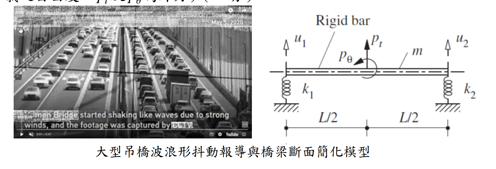

# 考題編號：SD-2024-2

**主分類：** `SD-U1-2` 運動方程式推導
**副分類：** `SD-U1-1` 結構動力基本性質及原理
**分析方法：** MDOF運動方程式推導（Lagrange法）
**標籤：** `渦激振動` `VIV` `氣動力彈性` `顫振` `強迫振動` `自激振動` `剛性桿` `橋梁斷面` `Lagrange方程式` `風工程` `質量矩陣` `勁度矩陣` `廣義座標`

---

## 1. 原始題目重述 (Problem Restatement)

**背景：** 某大型加勁鋼箱梁吊橋（橋面寬30公尺，雙向六車道），某日出現明顯波浪形抖動，隨後封閉通行。

**各子問題：**
- (一) 論述橋梁波浪形振動的主要原因（5分）
- (二) 此振動屬於自由振動還是強迫振動？（5分）
- (三) 依圖示簡化模型推導運動方程式（15分）

**簡化模型條件（圖示）：**

*圖說：均質剛性桿（Rigid bar），總質量 m，桿長 L（以中心為原點，左端 x = −L/2，右端 x = +L/2）。左端連接垂直彈簧 k₁，右端連接垂直彈簧 k₂（均連接至地面）。自由度：u₁ = 左端垂直位移（向上正），u₂ = 右端垂直位移（向上正）。外力：p_t = 施於中心之鉛直力，p_θ = 施於中心之力矩。*

---

## 2. 考題核心精神與出題者意圖 (Core Concepts & Examiner's Intent)

**核心觀念：** 橋梁風致振動的物理機制（工程判斷）+ 2-DOF 系統 Lagrange 推導（數學能力）。

**出題者測驗的能力：**
1. 能否正確辨別渦激振動（VIV）的物理機制，與一般地震強迫振動做概念區分
2. 能否判斷自由/強迫/自激振動的類別
3. 能否以 Lagrange 方程式，從能量觀點推導非對稱質量矩陣

**主要陷阱：**
- 誤以為橋梁振動是「自由振動」（沒有外力）→ 錯！風力持續作用
- 質量矩陣有**耦合項**（剛性桿的旋轉慣量貢獻），非對角矩陣
- 廣義力（Generalized force）計算需用虛功原理，p_t 與 p_θ 必須正確分解到 u₁、u₂

---

## 3. 解題戰略地圖與陷阱分析 (Strategic Roadmap & Trap Analysis)

**作戰計畫：**
1. (一) 論述渦激振動（VIV）的 Strouhal 數機制 + 共振條件
2. (二) 判斷為強迫振動（風力持續施加），說明鎖定（lock-in）後過渡為自激振動
3. (三) 定義幾何關係 → Lagrange → 建立 T（含轉動慣量）、V → 虛功計算廣義力 → 代入方程式

**關鍵陷阱：**

| # | 陷阱 | 應對 |
|---|------|------|
| 1 | 轉動慣量漏掉 | 均質剛性桿 $I = mL^2/12$，必須加入旋轉動能 |
| 2 | 質量矩陣以為是對角矩陣 | T 中含 $\dot{u}_1\dot{u}_2$ 耦合項 |
| 3 | 廣義力計算錯誤 | 用虛功原理：$Q_i = \partial(\delta W)/\partial(\delta u_i)$ |
| 4 | 混淆 VIV 與 flutter | VIV = 渦脫落頻率與結構頻率共振（強迫）；Flutter = 自激不穩定（自激） |

---

## 3.5 變數層次分析 (Variable Hierarchy Analysis)

> 複習提示：卡住的知識點旁標記 `⚠`；第二次複習時只看有 `⚠` 的項目。

### 最終目標
推導以 $u_1$、$u_2$ 為廣義座標的 2-DOF 剛性桿系統運動方程式

### 本題關鍵公式（依計算順序）

$$v = \frac{u_1+u_2}{2},\quad \theta = \frac{u_2-u_1}{L} \quad \text{（幾何關係）}$$

$$T = \frac{1}{2}m\dot{v}^2 + \frac{1}{2}I\dot{\theta}^2,\quad I=\frac{mL^2}{12} \quad \text{（動能，均質桿）}$$

$$V = \frac{1}{2}k_1 u_1^2 + \frac{1}{2}k_2 u_2^2 \quad \text{（應變能）}$$

$$\delta W = p_t\,\delta v + p_\theta\,\delta\theta \quad \text{（虛功）}$$

$$\frac{d}{dt}\frac{\partial T}{\partial \dot{q}_i} - \frac{\partial T}{\partial q_i} + \frac{\partial V}{\partial q_i} = Q_i \quad \text{（Lagrange 方程式）}$$

$$[M]\{\ddot{u}\} + [K]\{u\} = \{Q\} \quad \text{（矩陣形式）}$$

### L1：題目直接給定

| 符號 | 數值 | 說明 |
|------|------|------|
| $m$ | $m$ | 均質剛性桿總質量 |
| $k_1, k_2$ | $k_1, k_2$ | 左右端彈簧勁度 |
| $L$ | $L$ | 桿全長（中心至各端 L/2） |
| $u_1$ | 左端垂直位移 | 向上正 |
| $u_2$ | 右端垂直位移 | 向上正 |
| $p_t, p_\theta$ | 外力 | 中心處鉛直力與力矩 |

### L2：需知識點推導

**幾何分解**

| 符號 | 公式／來源 | 卡關? |
|------|-----------|-------|
| $v$（中心垂直位移） | $(u_1+u_2)/2$ | |
| $\theta$（旋轉角） | $(u_2-u_1)/L$ | |
| $I$（均質桿轉動慣量） | $mL^2/12$（繞中心） | |

**能量表達式**

| 符號 | 公式／來源 | 卡關? |
|------|-----------|-------|
| $T$（動能） | $\frac{m}{8}(\dot{u}_1+\dot{u}_2)^2 + \frac{m}{24}(\dot{u}_2-\dot{u}_1)^2$ | |
| $V$（位能） | $\frac{1}{2}k_1u_1^2 + \frac{1}{2}k_2u_2^2$ | |
| $M_{11}=M_{22}$ | $m/3$ | |
| $M_{12}=M_{21}$ | $m/6$ | |

**廣義力**

| 符號 | 公式／來源 | 卡關? |
|------|-----------|-------|
| $Q_1$ | $p_t/2 - p_\theta/L$ | |
| $Q_2$ | $p_t/2 + p_\theta/L$ | |

### L3：深層知識（不懂就卡住）

| 知識點 | 說明 | 卡關? |
|--------|------|-------|
| 均質桿轉動慣量 | $I = mL^2/12$（繞形心）；若繞端點則 $mL^2/3$ | |
| Lagrange 廣義力 | $Q_i = \partial(\delta W)/\partial(\delta q_i)$，不能直接套力的大小 | |
| VIV vs Flutter 物理機制 | VIV：渦脫落頻率→共振（被動受迫）；Flutter：氣動力矩放大旋轉→自激不穩定 | |
| Lock-in（鎖定效應） | 結構振幅增大後，渦脫落頻率被結構頻率「鎖定」，VIV 轉為自激特性 | |

---

## 4. 步驟化詳細計算過程 (Step-by-Step Detailed Calculation)

### (一) 波浪形振動的主要原因（5分）

**主因：渦激振動（Vortex-Induced Vibration, VIV）**

大跨度鋼箱梁吊橋出現波浪形抖動，主要原因為**卡門渦街（Kármán Vortex Street）引發之渦激共振**：

1. **渦脫落機制：** 風流過橋梁斷面時，在背風側交替形成渦旋（上下交替脫落），產生週期性側向（及鉛直向）激振力。

2. **Strouhal 數關係：** 渦脫落頻率 $f_s$ 由 Strouhal 數描述：
$$f_s = \frac{St \cdot U}{D}$$
其中 $St \approx 0.1\sim0.2$（斷面形狀決定），$U$ = 風速，$D$ = 特徵尺寸（桁高或梁深）。

3. **共振條件成立：** 當風速 $U$ 使得 $f_s$ 與橋梁垂直彎曲自然頻率 $f_n$ 相近時，產生共振：
$$f_s \approx f_n \implies U_{cr} = \frac{f_n \cdot D}{St}$$

4. **大跨度橋梁特性：** 大跨度橋梁自然頻率極低（週期長），對應臨界風速範圍寬廣，加上鋼箱梁阻尼比低（約 0.5%），一旦發生 VIV 即難以自行衰減。

5. **加劇因素：** 若橋梁施工期間有臨時設施（如維修欄板）改變斷面氣動外形，更易觸發 VIV（如 2020 年中國虎門大橋事件）。

$$\boxed{\text{主因：渦激共振（VIV）— 渦脫落頻率} f_s \text{ 與結構頻率} f_n \text{ 接近，引發大幅鉛直振動}}$$

---

### (二) 自由振動或強迫振動？（5分）

$$\boxed{\text{屬於強迫振動（Forced Vibration），更精確為含鎖定效應之自激強迫振動}}$$

**分析論述：**

| 振動類型 | 定義 | 本題判斷 |
|---------|------|---------|
| **自由振動** | 無外力，依初始條件振動，振幅隨時間衰減 | ✗ 不符：有持續風力 |
| **強迫振動** | 有週期性外力持續激振，穩態振幅取決於激振頻率與阻尼 | ✓ VIV 初期屬此類 |
| **自激振動** | 結構本身運動誘發氣動力，形成正回饋（負阻尼），振幅持續成長直到破壞 | ✓ Flutter 屬此類 |

**詳細說明：**
- 橋梁靜止時，風提供週期性渦脫落力（**外力激振**），屬**強迫振動**
- 振幅增大後，橋梁運動改變了局部流場，使渦脫落頻率「鎖定」於結構頻率（**Lock-in**），激振力與結構運動相互耦合，出現**自激振動**特性
- 若斷面進一步不穩定（氣動力矩隨旋轉角放大），則升級為**顫振（Flutter）**，屬純自激不穩定

> 本題橋梁最終判斷為**強迫振動為主**（VIV），與自由振動截然不同——自由振動不需外力且振幅只減不增；而本橋在持續風力作用下振幅穩定維持（或持續成長），符合強迫/自激振動特徵。

---

### (三) 推導簡化模型運動方程式（15分）

#### Step 1：定義系統與幾何關係

**系統：** 均質剛性桿，總質量 $m$，桿長 $L$，質心在中央。

**廣義座標：** $q_1 = u_1$（左端垂直位移），$q_2 = u_2$（右端垂直位移），均以向上為正。

**幾何分解**（設中心垂直位移 $v$，旋轉角 $\theta$）：

$$v = \frac{u_1 + u_2}{2}$$

$$\theta = \frac{u_2 - u_1}{L} \quad \text{（小角度，逆時針為正）}$$

反解：
$$u_1 = v - \frac{L}{2}\theta,\qquad u_2 = v + \frac{L}{2}\theta$$

---

#### Step 2：建立動能 $T$（含旋轉慣量）

均質剛性桿，總質量 $m$，對質心的轉動慣量：
$$I = \frac{mL^2}{12}$$

動能：
$$T = \frac{1}{2}m\dot{v}^2 + \frac{1}{2}I\dot{\theta}^2$$

代入 $\dot{v} = \dfrac{\dot{u}_1+\dot{u}_2}{2}$，$\dot{\theta} = \dfrac{\dot{u}_2-\dot{u}_1}{L}$：

$$T = \frac{m}{2}\left(\frac{\dot{u}_1+\dot{u}_2}{2}\right)^2 + \frac{1}{2}\cdot\frac{mL^2}{12}\left(\frac{\dot{u}_2-\dot{u}_1}{L}\right)^2$$

$$= \frac{m}{8}(\dot{u}_1+\dot{u}_2)^2 + \frac{m}{24}(\dot{u}_2-\dot{u}_1)^2$$

展開：
$$= \frac{m}{8}(\dot{u}_1^2 + 2\dot{u}_1\dot{u}_2 + \dot{u}_2^2) + \frac{m}{24}(\dot{u}_1^2 - 2\dot{u}_1\dot{u}_2 + \dot{u}_2^2)$$

整理各項係數：

- $\dot{u}_1^2$：$\dfrac{m}{8}+\dfrac{m}{24} = \dfrac{3m+m}{24} = \dfrac{m}{6}$
- $\dot{u}_2^2$：同上 $= \dfrac{m}{6}$
- $\dot{u}_1\dot{u}_2$：$2\left(\dfrac{m}{8}-\dfrac{m}{24}\right) = 2\cdot\dfrac{m}{12} = \dfrac{m}{6}$

$$T = \frac{m}{6}\left(\dot{u}_1^2 + \dot{u}_1\dot{u}_2 + \dot{u}_2^2\right)$$

寫成 $T = \dfrac{1}{2}\dot{\mathbf{u}}^T[M]\dot{\mathbf{u}}$ 的形式（注意係數 $\times 2$）：

$$[M] = \frac{m}{6}\begin{bmatrix}2 & 1 \\ 1 & 2\end{bmatrix}$$

*策略註解：耦合項 $M_{12}=m/6 \neq 0$ 是因為兩端位移都牽動質心運動，質量矩陣為非對角矩陣。*

---

#### Step 3：建立應變能 $V$（勁度矩陣）

左端彈簧 $k_1$ 壓縮量 $= u_1$，右端彈簧 $k_2$ 壓縮量 $= u_2$：

$$V = \frac{1}{2}k_1 u_1^2 + \frac{1}{2}k_2 u_2^2$$

$$[K] = \begin{bmatrix}k_1 & 0 \\ 0 & k_2\end{bmatrix}$$

*策略註解：勁度矩陣為對角矩陣，因為 $u_1$ 僅影響左端彈簧，$u_2$ 僅影響右端彈簧，無直接交叉勁度。*

---

#### Step 4：計算廣義力（虛功原理）

外力：中心處鉛直力 $p_t$（向上正），中心處力矩 $p_\theta$（逆時針正）。

虛功：
$$\delta W = p_t\,\delta v + p_\theta\,\delta\theta$$

代入 $\delta v = \dfrac{\delta u_1+\delta u_2}{2}$，$\delta\theta = \dfrac{\delta u_2-\delta u_1}{L}$：

$$\delta W = p_t\cdot\frac{\delta u_1+\delta u_2}{2} + p_\theta\cdot\frac{\delta u_2-\delta u_1}{L}$$

$$= \left(\frac{p_t}{2} - \frac{p_\theta}{L}\right)\delta u_1 + \left(\frac{p_t}{2} + \frac{p_\theta}{L}\right)\delta u_2$$

廣義力：
$$Q_1 = \frac{p_t}{2} - \frac{p_\theta}{L}, \qquad Q_2 = \frac{p_t}{2} + \frac{p_\theta}{L}$$

---

#### Step 5：代入 Lagrange 方程式，寫出運動方程式

Lagrange 方程式：
$$\frac{d}{dt}\frac{\partial T}{\partial \dot{q}_i} - \frac{\partial T}{\partial q_i} + \frac{\partial V}{\partial q_i} = Q_i,\quad i=1,2$$

（$T$ 不含 $q_i$，$V$ 不含 $\dot{q}_i$，無阻尼項）代入得：

$$\boxed{
\frac{m}{6}\begin{bmatrix}2 & 1 \\ 1 & 2\end{bmatrix}\begin{Bmatrix}\ddot{u}_1\\\ddot{u}_2\end{Bmatrix} + \begin{bmatrix}k_1 & 0 \\ 0 & k_2\end{bmatrix}\begin{Bmatrix}u_1\\u_2\end{Bmatrix} = \begin{Bmatrix}\dfrac{p_t}{2}-\dfrac{p_\theta}{L}\\[10pt]\dfrac{p_t}{2}+\dfrac{p_\theta}{L}\end{Bmatrix}
}$$

展開為純量方程式：

$$\frac{m}{3}\ddot{u}_1 + \frac{m}{6}\ddot{u}_2 + k_1 u_1 = \frac{p_t}{2} - \frac{p_\theta}{L}$$

$$\frac{m}{6}\ddot{u}_1 + \frac{m}{3}\ddot{u}_2 + k_2 u_2 = \frac{p_t}{2} + \frac{p_\theta}{L}$$

---

#### Step 6：驗算（轉換為 v-θ 座標）

若以 $(v, \theta)$ 為廣義座標，對角化後應得：

$$m\ddot{v} + (k_1+k_2)v + \frac{(k_2-k_1)L}{2}\theta = p_t$$

$$\frac{mL^2}{12}\ddot{\theta} + \frac{(k_2-k_1)L}{2}v + \frac{(k_1+k_2)L^2}{4}\theta = p_\theta$$

若 $k_1 = k_2$，則兩個方程式解耦（垂直平動與旋轉獨立），與對稱結構的直覺一致 ✓

---

## 5. 關鍵爭議點與進階探討 (Critical Issues & Advanced Discussion)

**1. VIV 與顫振（Flutter）的本質差異：**

| 特徵 | VIV（渦激振動） | Flutter（顫振） |
|------|---------------|----------------|
| 激振來源 | 渦脫落（外部氣動力） | 運動誘發氣動力（自激） |
| 振幅 | 有限（Lock-in 後穩定） | 無限成長（負阻尼） |
| 臨界條件 | $f_s \approx f_n$ | $U > U_{flutter}$ |
| 危險性 | 疲勞損傷 | 結構崩潰（如 Tacoma Narrows） |
| 設計對策 | 調整斷面形狀、加裝導流板 | 增加扭轉頻率與彎曲頻率比 |

**2. 為何此橋判斷為 VIV 而非 Flutter：**
- 橋梁未坍塌，振幅在封橋後自行衰減 → 有限振幅特性，符合 VIV
- Flutter 一旦觸發會快速發散（Tacoma Narrows 僅 40 分鐘後坍塌）

**3. 考場安全解法：**
廣義力計算是本題最常出錯之處。虛功法最安全：先寫 $\delta W$，再從 $\delta u_1$、$\delta u_2$ 係數讀出 $Q_1$、$Q_2$，避免方向錯誤。

**4. 若 $k_1 = k_2 = k$（對稱斷面）的簡化：**
- 質量矩陣不變（仍有耦合）
- 勁度矩陣 $[K] = k[I]$（對角）
- 此時系統振態為純垂直和純旋轉，對應顫振分析的彎扭模態

**5. 實務橋梁斷面風洞試驗目的：**
量測斷面氣動力係數（升力係數、力矩係數及其導數 $C_{L\alpha}$、$C_{M\alpha}$），確認在設計風速下不發生顫振，並評估 VIV 振幅是否在容許範圍內。
