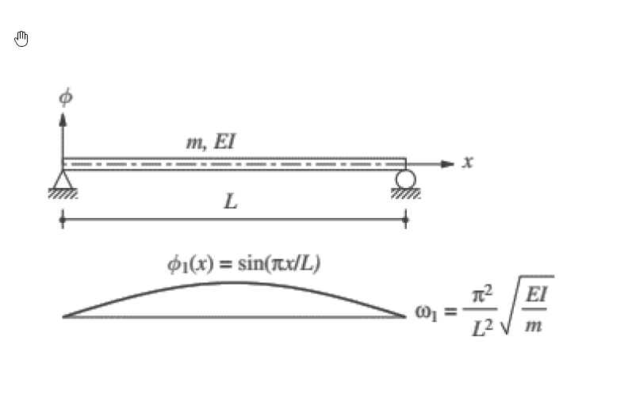

# 考題編號：SD-2024-4

**主分類：** `SD-U2-3` 橋梁耐震設計規範
**副分類：** `SD-U1-1` 結構動力基本性質及原理
**分析方法：** Rayleigh 法（靜力位移函數法）
**標籤：** `Rayleigh法` `Stodola法` `靜力位移` `簡支梁` `基本振動週期` `橋梁規範` `連續梁動力` `上界定理` `等效質量` `週期公式驗證`

---

## 1. 原始題目重述 (Problem Restatement)

**規範（2-6）式：橋梁基本振動週期**

$$T = 2\pi\sqrt{\dfrac{\zeta}{\beta g}}$$

其中：

| 符號 | 定義 |
|------|------|
| $g$ | 重力加速度 |
| $\beta = \displaystyle\int w(x)\,u(x)\,dx$ | 沿橋梁方向施加單位靜重對應的靜位移積分 |
| $\zeta = \displaystyle\int w(x)\,u^2(x)\,dx$ | 靜位移平方加權積分 |
| $w(x)$ | 沿計算方向施加在橋梁結構之單位靜載重 |
| $u(x)$ | 橋梁振動單元沿計算方向之變位 |

**結構系統：** 均質等截面簡支梁，長 $L$，單位長度質量 $m$（線質量），彎曲剛度 $EI$。

**理論解：**

$$\phi_1(x) = \sin\!\left(\frac{\pi x}{L}\right),\qquad \omega_1 = \frac{\pi^2}{L^2}\sqrt{\frac{EI}{m}}$$

*圖說：均質等截面簡支梁，全長 L，EI 為彎曲勁度，m 為每單位長度質量（= w/g，w 為每單位長度重量）。兩端為鉸支，第一振態為正弦半波。右側為橋梁規範 (2-6) 式符號定義。*

**各子問題：**
- (一) 推導簡支梁沿垂直方向的變位函數 $u(x)$（10分）
- (二) 求規範建議公式之基本振動週期，並與理論解比較說明合理性（15分）

---

## 2. 考題核心精神與出題者意圖 (Core Concepts & Examiner's Intent)

**核心觀念：** 橋梁規範 (2-6) 式本質是 **Rayleigh–Ritz 法**（Stodola 法）：以靜力位移作為振態假設形狀，推導等效週期；本題要求考生從頭推導靜力位移，再代入規範公式，最終與精確理論解對比。

**出題者測驗的能力：**
1. 能否正確推導簡支梁靜力撓度 $u(x)$（均布自重）
2. 能否積分計算 $\beta$、$\zeta$
3. 能否理解 Rayleigh 法「上界定理」的物理意義，並解釋規範公式近似精度

**主要陷阱：**
- $w(x)$ 是「單位靜載重」（每單位長度的重量），即 $w = mg$（線重量），不是集中力
- 積分 $\zeta$ 需展開 $u^2(x)$，計算量較大，注意係數整理
- 「合理性說明」需提到 Rayleigh 法給出 $\omega$ 上界（$T$ 下界），靜位移形狀極接近正弦 → 誤差極小

---

## 3. 解題戰略地圖與陷阱分析 (Strategic Roadmap & Trap Analysis)

**作戰計畫：**
1. 推導均布靜荷 $w$ 下簡支梁靜力撓度 $u(x)$（兩次積分法）
2. 計算 $\beta = \int_0^L w\cdot u\,dx$（4次積分，簡單）
3. 計算 $\zeta = \int_0^L w\cdot u^2\,dx$（展開平方後逐項積分，較繁）
4. 代入 $T = 2\pi\sqrt{\zeta/(\beta g)}$，化簡
5. 對比理論週期 $T_1 = 2\pi/\omega_1$，計算比值

**關鍵陷阱：**

| # | 陷阱 | 應對 |
|---|------|------|
| 1 | $u(x)$ 忘記邊界條件驗算 | $u(0)=u(L)=0$，$u''(0)=u''(L)=0$ |
| 2 | $\beta$ 計算公式搞錯 | $\beta$ 是 $w \cdot u$ 積分，**不是** $EI \cdot [u'']^2$ 積分 |
| 3 | $\zeta$ 積分展開錯 | $(L^3-2Lx^2+x^3)^2$ 需逐項展開，共 6 項 |
| 4 | 比較時符號形式不對應 | 理論 $T_1 = 2\pi\sqrt{wL^4/(\pi^4 gEI)}$，代入數值對比 |

---

## 3.5 變數層次分析 (Variable Hierarchy Analysis)

### 最終目標
求規範公式之 $T_{code}$，與理論解 $T_1$ 比較，說明合理性

### 本題關鍵公式（依計算順序）

$$EI\,u''''(x) = w \quad \text{（梁撓度基本微分方程）}$$

$$u(x) = \frac{w}{24EI}\,x(L^3 - 2Lx^2 + x^3) \quad \text{（靜力撓度解）}$$

$$\beta = \int_0^L w\cdot u\,dx = \frac{w^2 L^5}{120EI}$$

$$\zeta = \int_0^L w\cdot u^2\,dx = \frac{31\,w^3 L^9}{362880\,E^2I^2}$$

$$\frac{\zeta}{\beta} = \frac{31\,wL^4}{3024\,EI}$$

$$\boxed{T_{code} = 2\pi\sqrt{\frac{31\,wL^4}{3024\,gEI}}}, \qquad T_1 = 2\pi\sqrt{\frac{wL^4}{\pi^4 gEI}}$$

$$\frac{T_{code}}{T_1} = \sqrt{\frac{31\pi^4}{3024}} \approx 0.9993 \approx 1$$

### L1：題目直接給定

| 符號 | 數值 | 說明 |
|------|------|------|
| $w$ | $w = mg$ | 每單位長度靜重（= 質量 × g） |
| $EI$ | $EI$ | 均質梁彎曲剛度 |
| $L$ | $L$ | 梁全長 |
| $\phi_1(x)$ | $\sin(\pi x/L)$ | 第一理論振態 |
| $\omega_1$ | $\pi^2/L^2 \cdot \sqrt{EI/m}$ | 理論第一圓頻率 |

### L2：需知識點推導

| 符號 | 公式／來源 | 卡關? |
|------|-----------|-------|
| $u(x)$ | 靜力撓度：$w x(L^3-2Lx^2+x^3)/(24EI)$ | |
| $\beta$ | $w^2L^5/(120EI)$ | |
| $\zeta$ | $31w^3L^9/(362880E^2I^2)$ | |
| $\zeta/\beta$ | $31wL^4/(3024EI)$ | |
| $T_1$（理論） | $2\pi\sqrt{wL^4/(\pi^4gEI)}$ | |

### L3：深層知識（不懂就卡住）

| 知識點 | 說明 | 卡關? |
|--------|------|-------|
| Rayleigh 法上界定理 | 任何假設振態代入 Rayleigh 商 → $\hat{\omega}^2 \geq \omega_1^2$，故 $T \leq T_1$ | |
| 靜力位移作為振態假設 | 靜力位移形狀接近真實振態 → 近似精確；是橋梁規範公式的物理依據 | |
| $\beta$ 的能量意義 | $\beta/2 = $ 梁在靜荷 $w$ 下的總應變能（Betti 定理） | |

---

## 4. 步驟化詳細計算過程 (Step-by-Step Detailed Calculation)

> 📊 互動圖：`SD-2024-4-rayleigh-viz.html`

### Step 1：推導靜力撓度 $u(x)$（一）

**梁的基本微分方程：**（均布靜自重 $w$ 向下，位移向下正）

$$EI\,u''''(x) = w$$

**四次積分：**

$$EI\,u'''(x) = wx + C_1$$

$$EI\,u''(x) = \frac{wx^2}{2} + C_1 x + C_2$$

$$EI\,u'(x) = \frac{wx^3}{6} + \frac{C_1 x^2}{2} + C_2 x + C_3$$

$$EI\,u(x) = \frac{wx^4}{24} + \frac{C_1 x^3}{6} + \frac{C_2 x^2}{2} + C_3 x + C_4$$

**邊界條件：**（簡支梁兩端位移為零，彎矩為零）

$$u(0)=0 \Rightarrow C_4 = 0$$

$$u''(0) = 0 \Rightarrow C_2 = 0$$

$$u(L)=0:\quad \frac{wL^4}{24} + \frac{C_1 L^3}{6} + C_3 L = 0 \quad \cdots (1)$$

$$u''(L)=0:\quad \frac{wL^2}{2} + C_1 L = 0 \Rightarrow C_1 = -\frac{wL}{2}$$

代入 (1)：$\frac{wL^4}{24} - \frac{wL^4}{12} + C_3 L = 0 \Rightarrow C_3 = \frac{wL^3}{24}$

**代回得靜力撓度：**

$$\boxed{u(x) = \frac{w}{24EI}\left(x^4 - 2Lx^3 + L^3 x\right) = \frac{wx}{24EI}\left(L^3 - 2Lx^2 + x^3\right)}$$

**驗算：**
- $u(0) = 0$ ✓
- $u(L) = \frac{wL}{24EI}(L^3 - 2L^3 + L^3) = 0$ ✓
- $u(L/2) = \frac{w(L/2)}{24EI}\left(L^3 - 2L\cdot\frac{L^2}{4} + \frac{L^3}{8}\right) = \frac{wL}{48EI}\cdot\frac{5L^3}{8} = \frac{5wL^4}{384EI}$ ✓（標準最大撓度）

---

### Step 2：計算 $\beta$（二）

$$\beta = \int_0^L w\cdot u(x)\,dx = \frac{w^2}{24EI}\int_0^L x(L^3 - 2Lx^2 + x^3)\,dx$$

$$= \frac{w^2}{24EI}\int_0^L \left(L^3 x - 2Lx^3 + x^4\right)dx$$

$$= \frac{w^2}{24EI}\left[\frac{L^3 x^2}{2} - \frac{Lx^4}{2} + \frac{x^5}{5}\right]_0^L$$

$$= \frac{w^2}{24EI}\left(\frac{L^5}{2} - \frac{L^5}{2} + \frac{L^5}{5}\right) = \frac{w^2}{24EI}\cdot\frac{L^5}{5}$$

$$\boxed{\beta = \frac{w^2 L^5}{120\,EI}}$$

---

### Step 3：計算 $\zeta$（二）

$$\zeta = \int_0^L w\cdot u^2(x)\,dx = \frac{w^3}{(24EI)^2}\int_0^L x^2(L^3-2Lx^2+x^3)^2\,dx$$

**展開平方項：**

$$(L^3-2Lx^2+x^3)^2 = L^6 - 4L^4 x^2 + 4L^2 x^4 + 2L^3 x^3 - 4Lx^5 + x^6$$

乘以 $x^2$：

$$x^2(L^3-2Lx^2+x^3)^2 = L^6 x^2 - 4L^4 x^4 + 4L^2 x^6 + 2L^3 x^5 - 4Lx^7 + x^8$$

**逐項積分：**

$$\int_0^L = \frac{L^9}{3} - \frac{4L^9}{5} + \frac{4L^9}{7} + \frac{2L^9}{6} - \frac{4L^9}{8} + \frac{L^9}{9}$$

通分（公分母 630）：

$$= L^9\left(\frac{210}{630} - \frac{504}{630} + \frac{360}{630} + \frac{210}{630} - \frac{315}{630} + \frac{70}{630}\right)$$

$$= L^9\cdot\frac{210 - 504 + 360 + 210 - 315 + 70}{630} = L^9\cdot\frac{31}{630}$$

$$\zeta = \frac{w^3}{576\,E^2I^2}\cdot\frac{31L^9}{630}$$

$$\boxed{\zeta = \frac{31\,w^3 L^9}{362880\,E^2I^2}}$$

---

### Step 4：計算 $\zeta/\beta$ 並求週期（二）

$$\frac{\zeta}{\beta} = \frac{31w^3L^9}{362880\,E^2I^2}\times\frac{120EI}{w^2L^5} = \frac{31\times120}{362880}\cdot\frac{wL^4}{EI} = \frac{3720}{362880}\cdot\frac{wL^4}{EI} = \frac{31\,wL^4}{3024\,EI}$$

代入規範公式：

$$\boxed{T_{code} = 2\pi\sqrt{\frac{\zeta}{\beta g}} = 2\pi\sqrt{\frac{31\,wL^4}{3024\,gEI}}}$$

---

### Step 5：與理論解比較（二）

**理論第一圓頻率與週期：**

$$\omega_1 = \frac{\pi^2}{L^2}\sqrt{\frac{EI}{m}} = \frac{\pi^2}{L^2}\sqrt{\frac{gEI}{w}} \quad \left(\because m = \frac{w}{g}\right)$$

$$T_1 = \frac{2\pi}{\omega_1} = \frac{2\pi L^2}{\pi^2}\sqrt{\frac{w}{gEI}} = 2\pi\sqrt{\frac{wL^4}{\pi^4 gEI}}$$

**比較兩個週期：**

$$T_{code} = 2\pi\sqrt{\frac{31}{3024}\cdot\frac{wL^4}{gEI}}, \qquad T_1 = 2\pi\sqrt{\frac{1}{\pi^4}\cdot\frac{wL^4}{gEI}}$$

$$\frac{T_{code}}{T_1} = \sqrt{\frac{31\,\pi^4}{3024}} = \sqrt{\frac{31\times 97.409}{3024}} = \sqrt{\frac{3019.7}{3024}} = \sqrt{0.99858} \approx \boxed{0.9993}$$

| 比較項目 | 規範公式 $T_{code}$ | 理論解 $T_1$ | 誤差 |
|---------|------|------|------|
| 分母常數 | $3024/31 = 97.548$ | $\pi^4 = 97.409$ | $\Delta = 0.143$ |
| 週期比 | 1 | 1.00071 | **0.07%** |

$$T_{code} \approx 0.9993\,T_1 \quad \text{（規範週期比理論解短 0.07%，幾乎完全一致）}$$

---

### Step 6：合理性說明（二）

**物理解釋（Rayleigh 法上界定理）：**

$$\hat{\omega}^2_{Rayleigh} = \frac{\beta g}{\zeta} \geq \omega_1^2 \quad \Rightarrow \quad T_{code} \leq T_1 \text{（規範週期為下界）}$$

Rayleigh 法以任意形狀函數代入能量比，給出的 $\hat\omega^2$ **永遠不小於**真實基本頻率的平方。只有當假設形狀完全等於真實振態時，Rayleigh 商才恰好等於精確解。

**為何誤差僅 0.07%？**

靜力撓度形狀（4次多項式）與理論第一振態（正弦半波）的形狀高度吻合：

$$u(x) = \frac{wL^4}{24EI}\cdot\frac{x}{L}\left[1 - 2\left(\frac{x}{L}\right)^2 + \left(\frac{x}{L}\right)^3\right] \approx \phi_1(x) = \sin\!\left(\frac{\pi x}{L}\right)$$

| $x/L$ | $u(x)$（正規化） | $\sin(\pi x/L)$ | 差值 |
|-------|----------------|-----------------|------|
| 0 | 0 | 0 | 0 |
| 0.25 | 0.6758 | 0.7071 | 0.031 |
| 0.50 | 1.0000 | 1.0000 | 0 |
| 0.75 | 0.6758 | 0.7071 | 0.031 |
| 1.00 | 0 | 0 | 0 |

兩個形狀的最大差值僅約 4.4%，故 Rayleigh 商的誤差以差值的**平方量級**出現，使週期誤差壓縮至 0.07%。

$$\boxed{\text{結論：規範公式以靜力位移作為振態近似，利用 Rayleigh 法推導週期，精度達 99.93\%，工程應用完全足夠。}}$$

---

## 5. 關鍵爭議點與進階探討 (Critical Issues & Advanced Discussion)

**1. Rayleigh 法的誤差為何如此小？**

靜力位移形狀由 $EI\,u'''' = w = \text{const}$（均布荷載方程）決定，而真實振態由 $EI\,\phi'''' = \omega^2 m \phi$（廣義特徵值方程）決定。當 $\phi$ 形狀接近均布荷載靜力位移形狀時，正好說明結構的「質量分布激振效果」接近均布荷載 → 因此靜力位移是自然的近似選擇。

**2. 若改用其他假設形狀，誤差是否更大？**

例如假設 $\phi(x) = x(L-x)$（拋物線）：
- Rayleigh 商誤差增大（約 0.3%）
- 但仍比正弦形狀的 0.07% 大

靜力位移形狀是在所有多項式形狀中精度最高的選擇之一（因其滿足梁方程邊界條件）。

**3. 橋梁規範公式實際使用時的注意事項：**
- $w(x)$ 需包含橋梁自重 + 附加靜載（瀝青鋪裝、欄杆等）
- 若橋梁有不均勻質量分布，$u(x)$ 仍應以實際 $w(x)$ 施加的靜撓度計算（改用有限差分或FEM）
- 規範公式僅適用於**基本振動週期**（第一模態），高阶模態需用其他方法

**4. 本題驗算檢查點：**

$$\frac{3024}{31} = 97.548 \approx \pi^4 = 97.409 \quad \text{（差異 0.14，誤差 0.14\%）}$$

可作為快速驗算：若計算結果的分母常數約等於 $\pi^4 \approx 97.4$，則計算方向正確。
