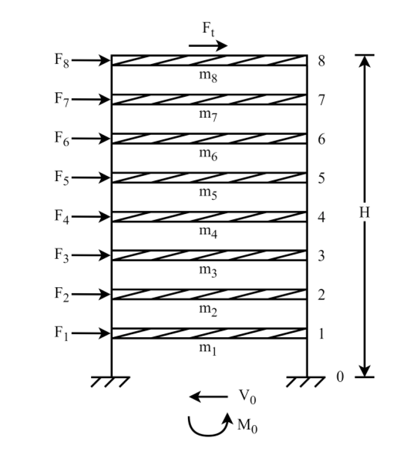

# 考題編號：SD-2025-1

**主分類：** `SD-U2-2` 建築耐震設計規範
**副分類：** `SD-U2-1` 地震力之設計規範
**分析方法：** 等效靜力法
**標籤：** `等效靜力法` `設計地震力` `樓層剪力分布` `基底剪力` `頂部集中力` `建築耐震規範`

---

## 1. 原始題目重述 (Problem Restatement)

一棟 8 層樓平面構架，各樓層高 3.5 m，總樓高 H = 28 m，各樓層重 20 kN，總重 W = 160 kN。

已知：
- 基本周期 T = 0.8 sec
- 重要性因子 I = 1.25
- 設計地震加速度係數 S_aD = 0.6
- 結構韌性容量 Fu = 2
- 結構基本降伏地震力放大倍數 αy = 1.4

設計地震水平總橫力公式：

$$V = \frac{I \cdot S_{aD}}{1.4\,\alpha_y \cdot F_u} W$$

**求：**
1. 基底總剪力 V₀（5 分）
2. 各樓層設計水平力 Fᵢ（15 分）
3. 基底總彎矩 M₀（5 分）



*圖說：8層等高構架（各層 3.5m），第 i 層高度 hᵢ = 3.5i m，各層質量相同（wᵢ = 20 kN）。頂部額外集中力 Ft 施加於第 8 層（h₈ = 28 m）。*

---

## 2. 考題核心精神與出題者意圖 (Core Concepts & Examiner's Intent)

**核心觀念：** 台灣建築耐震設計規範等效靜力法的完整操作流程。

**出題者測驗能力：**
1. 能否正確套用設計地震力公式（V 公式分子分母組成）
2. 是否知道「T > 0.7 sec 時需計算頂部集中力 Ft」這個關鍵條件
3. 樓層分配力的高度加權原則（高樓層分配較多）
4. 能否累加得到基底彎矩（等效靜力的力矩計算）

**陷阱核心：** 很多考生忘記 T = 0.8 sec > 0.7 sec 需加 Ft，直接用 V 分配，導致 F₈ 算少、M₀ 偏低。

---

## 3. 解題戰略地圖與陷阱分析 (Strategic Roadmap & Trap Analysis)

**作戰計畫：**
```
Step 1: 代入 V 公式 → V₀
Step 2: 判斷 T 是否 > 0.7 sec → 計算頂部集中力 Ft
Step 3: V' = V₀ - Ft，計算 Σwᵢhᵢ（高度加權總和）
Step 4: 各樓層 Fᵢ = (wᵢhᵢ/Σwⱼhⱼ) × V'
Step 5: M₀ = Σ Fᵢ × hᵢ + Ft × H（所有力對底部取矩）
```

**關鍵陷阱：**

| 陷阱 | 說明 | 應對 |
|------|------|------|
| ⚠ 忘記 Ft | T = 0.8 > 0.7 sec，必須計算頂部集中力 | Ft = 0.07TV，且 Ft ≤ 0.25V |
| ⚠ Ft 上限 | 若 0.07TV > 0.25V，取 Ft = 0.25V | 本題 0.07×0.8 = 0.056 < 0.25，無上限問題 |
| ⚠ V 公式分母 | 分母是 1.4 × αy × Fu，不是 αy × Fu | 注意 1.4 為固定係數（非標準 1.0） |
| ⚠ Ft 計入 M₀ | Ft 施加於頂層，需 × H 計入彎矩 | M₀ 含 Ft × 28 項 |

---

## 3.5 變數層次分析 (Variable Hierarchy Analysis)

> 複習提示：第一次解題後，在每個卡住的知識點旁標記 `⚠`；第二次複習時只看有 `⚠` 的項目。

### 最終目標
求基底剪力 V₀、各樓層地震力 Fᵢ（含頂部集中力 Ft）及基底彎矩 M₀。

### 本題關鍵公式（依計算順序）

$$V_0 = \frac{I \cdot S_{aD}}{1.4\,\alpha_y \cdot F_u} \cdot W \quad \text{（設計地震力）}$$

$$F_t = 0.07\,T \cdot V_0 \quad (T > 0.7\text{ sec}) \quad \text{（頂部集中力）}$$

$$V' = \boxed{V_0} - \boxed{F_t} \quad \text{（扣除頂部集中力後的剩餘剪力）}$$

$$F_i = \frac{w_i h_i}{\sum_j w_j h_j} \cdot \boxed{V'} \quad \text{（各樓層分配力）}$$

$$M_0 = \sum_{i=1}^{8} F_i \cdot h_i + \boxed{F_t} \cdot H \quad \text{（基底彎矩，所有力對底部取矩）}$$

### L1：題目直接給定

| 符號 | 數值 | 說明 |
|------|------|------|
| n | 8 | 樓層數 |
| h_story | 3.5 m | 各層高度 |
| H | 28 m | 總樓高 |
| w_i | 20 kN（各層均等） | 各樓層重量 |
| W | 160 kN | 總重 |
| T | 0.8 sec | 基本周期 |
| I | 1.25 | 重要性因子 |
| S_aD | 0.6 | 設計地震加速度係數 |
| F_u | 2 | 結構韌性容量 |
| α_y | 1.4 | 基本降伏地震力放大倍數 |

### L2：需知識點推導

**① 設計地震力 V₀**

| 符號 | 公式／來源 | 卡關? |
|------|-----------|-------|
| V₀ | V = IS_aD/(1.4α_y·Fu)×W | |

**② 頂部集中力 Ft**

| 符號 | 公式／來源 | 卡關? |
|------|-----------|-------|
| 判斷條件 | T = 0.8 > 0.7 sec → 需計算 Ft | |
| Ft | 0.07 × T × V₀ ≤ 0.25V₀ | |
| V' | V₀ − Ft | |

**③ 各樓層高度與加權項**

| 符號 | 公式／來源 | 卡關? |
|------|-----------|-------|
| hᵢ | 3.5i（m），i=1~8 | |
| Σwᵢhᵢ | Σ 20×3.5i，i=1~8 | |
| wᵢhᵢ/Σwⱼhⱼ | 高度加權比例 | |

**④ 樓層力與基底彎矩**

| 符號 | 公式／來源 | 卡關? |
|------|-----------|-------|
| Fᵢ | (wᵢhᵢ/Σwⱼhⱼ) × V' | |
| M₀ | ΣFᵢ×hᵢ + Ft×H | |

### L3：深層知識（不懂就卡住）

| 知識點 | 說明 | 卡關? |
|--------|------|-------|
| Ft 存在條件 | 台灣規範：T > 0.7 sec 時，高階模態效應顯著，頂部需加額外集中力 Ft = 0.07TV（最大 0.25V） | |
| 等高度加權分配 | 模擬第一振態（倒三角形）分布：hᵢ 越大分配越多 | |
| αy 物理意義 | 結構實際屈服時比設計地震力大 αy 倍（過強度），故設計地震力需除以 αy（設計地震力 = 最大地震力 / (αy×Fu)） | |
| M₀ 計算 | Ft 雖與 F₈ 都在頂層，在計算 M₀ 時必須**分開**處理（兩者都乘以 h₈ = 28 m）| |

---

## 4. 步驟化詳細計算過程 (Step-by-Step Detailed Calculation)

> 📊 互動圖：`SD-2025-1-seismic-viz.html`

### Step 1：基底總剪力 V₀

$$V_0 = \frac{I \cdot S_{aD}}{1.4\,\alpha_y \cdot F_u} \cdot W = \frac{1.25 \times 0.6}{1.4 \times 1.4 \times 2} \times 160$$

$$= \frac{0.75}{3.92} \times 160 = 0.1913 \times 160$$

$$\boxed{V_0 \approx 30.61 \text{ kN}}$$

---

### Step 2：頂部集中力 Ft

由於 T = 0.8 sec **> 0.7 sec**，需計算 Ft：

$$F_t = 0.07 \times T \times V_0 = 0.07 \times 0.8 \times 30.61 = 1.714 \text{ kN}$$

驗核上限：$0.25 V_0 = 7.65 \text{ kN} > 1.714 \text{ kN}$ ✓（未超過上限）

剩餘分配剪力：

$$V' = V_0 - F_t = 30.61 - 1.71 = 28.90 \text{ kN}$$

---

### Step 3：高度加權總和 Σwᵢhᵢ

各樓層高度 hᵢ = 3.5i（m），各層 wᵢ = 20 kN：

$$\sum w_i h_i = 20 \times (3.5 + 7.0 + 10.5 + 14.0 + 17.5 + 21.0 + 24.5 + 28.0)$$
$$= 20 \times 126.0 = 2520 \text{ kN·m}$$

---

### Step 4：各樓層設計水平力 Fᵢ

$$F_i = \frac{w_i h_i}{\sum w_j h_j} \times V' = \frac{20 h_i}{2520} \times 28.90$$

| 樓層 i | hᵢ (m) | wᵢhᵢ (kN·m) | wᵢhᵢ/Σ | Fᵢ (kN) |
|:------:|:------:|:----------:|:------:|:-------:|
| 1 | 3.5 | 70 | 1/36 | **0.803** |
| 2 | 7.0 | 140 | 2/36 | **1.606** |
| 3 | 10.5 | 210 | 3/36 | **2.408** |
| 4 | 14.0 | 280 | 4/36 | **3.211** |
| 5 | 17.5 | 350 | 5/36 | **4.014** |
| 6 | 21.0 | 420 | 6/36 | **4.817** |
| 7 | 24.5 | 490 | 7/36 | **5.619** |
| 8 | 28.0 | 560 | 8/36 | **6.422** |
| **Σ** | — | **2520** | **1** | **28.90** ✓ |

第 8 層實際設計水平力（含頂部集中力）：

$$F_8^{(\text{total})} = F_8 + F_t = 6.422 + 1.714 = \mathbf{8.136 \text{ kN}}$$

---

### Step 5：基底總彎矩 M₀

$$M_0 = \sum_{i=1}^{8} F_i \cdot h_i + F_t \cdot H$$

先算 ΣFᵢhᵢ：

$$\sum F_i h_i = \frac{V'}{\sum w_j h_j} \sum w_i h_i^2$$

$$\sum w_i h_i^2 = 20\times(3.5^2+7^2+10.5^2+14^2+17.5^2+21^2+24.5^2+28^2)$$
$$= 20\times(12.25+49+110.25+196+306.25+441+600.25+784)$$
$$= 20 \times 2499 = 49\,980 \text{ kN·m}^2$$

$$\sum F_i h_i = \frac{28.90}{2520} \times 49\,980 = 0.01147 \times 49\,980 = 573.3 \text{ kN·m}$$

加入頂部集中力貢獻：

$$M_0 = 573.3 + 1.714 \times 28 = 573.3 + 48.0 = \boxed{621.3 \text{ kN·m}}$$

---

### 彙整答案

| 問題 | 答案 |
|------|------|
| (一) 基底總剪力 V₀ | **30.61 kN** |
| (二) 頂部集中力 Ft（加於 F₈ 上） | **1.714 kN**；各樓層 Fᵢ 詳見上表 |
| (三) 基底總彎矩 M₀ | **621.3 kN·m** |

---

## 5. 關鍵爭議點與進階探討 (Critical Issues & Advanced Discussion)

### 5.1 Ft 的規範依據與物理意義

台灣建築耐震設計規範規定：當 T > 0.7 sec 時，結構高階模態效應不可忽略。頂部集中力 Ft = 0.07TV（最大 0.25V）是對高階模態的**簡化等效修正**——因為高階模態使頂部的相對加速度更大。本題 Ft/V₀ = 1.714/30.61 = 5.6%，影響不算小。

### 5.2 等效靜力法的適用範圍

本公式 V = IS_aD/(1.4αy·Fu)×W 為台灣舊版建築耐震規範（921 後修訂版）格式。新版規範改以 SDS、SD1 表示設計反應譜（參考 SD-C-011）。考場上須注意題目提示的規範版本。

### 5.3 M₀ 等效高度

$$h_{eq} = \frac{M_0}{V_0} = \frac{621.3}{30.61} \approx 20.3 \text{ m} \approx 0.73H$$

倒三角形分布時理論等效高度為 2H/3 ≈ 0.667H，本題稍高（因 Ft 貢獻），合理。

### 5.4 考場答題策略

- 分數分配：V₀（5分）、Fᵢ（15分）、M₀（5分）
- 若計算 Ft 出錯，後兩題連帶失分，但步驟分仍可部分給分
- 最安全做法：先列 Ft 公式並判斷條件，再代入數字
