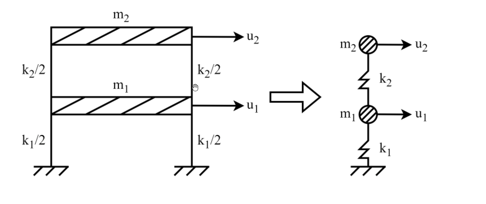

# 考題編號：SD-2025-2

**主分類：** `SD-U1-3` 單自由度、多自由度系統之動態分析及應用
**副分類：** `SD-U1-1` 結構動力基本性質及原理
**分析方法：** MDOF模態分析
**標籤：** `MDOF` `2自由度` `特徵值問題` `振態向量` `自然頻率` `模態參與因子` `剪力建築` `黃金比例`

---

## 1. 原始題目重述 (Problem Restatement)

一棟 2 層樓平面構架簡化為 2-DOF 結構系統。

質量矩陣：
$$[M] = \begin{bmatrix} m_1 & 0 \\ 0 & m_2 \end{bmatrix} \quad (\text{kN·sec}^2/\text{m})$$

勁度矩陣：
$$[K] = \begin{bmatrix} k_{11} & k_{12} \\ k_{21} & k_{22} \end{bmatrix} \quad (\text{kN/m})$$

已知：$m_1 = m_2 = 100 \text{ kN·sec}^2/\text{m}$，$k_1 = k_2 = 1500 \text{ kN/m}$

**求：**
1. 各模態週期 $T_i$ 與頻率 $\omega_i$（10 分）
2. 各模態形狀係數 $\{\phi\}_i$（10 分）
3. 各模態貢獻參與係數 $\Gamma_i$（5 分）



*圖說：兩層剪力建築架，k₁ = k₂ = 1500 kN/m（每層兩側各 k/2），m₁ = m₂ = 100 kN·sec²/m，u₁ 為第一層側向位移，u₂ 為第二層側向位移。*

---

## 2. 考題核心精神與出題者意圖 (Core Concepts & Examiner's Intent)

**核心觀念：** MDOF 系統特徵值問題的完整求解流程（剛度矩陣組裝 → 行列式展開 → 求 ωᵢ → 回代求振態 → 計算參與因子）。

**出題者測驗能力：**
1. 能否正確組裝剪力建築的剛度矩陣（非直接給定 k₁₁、k₁₂）
2. 特徵值（λ = ω²）二次方程式的求解
3. 振態正規化與物理意義理解
4. 模態參與因子公式的正確應用

**亮點：** 本題的振態比值恰好是黃金比例 φ = (1+√5)/2 ≈ 1.618，體現了等質量等剛度剪力建築的數學美感。

---

## 3. 解題戰略地圖與陷阱分析 (Strategic Roadmap & Trap Analysis)

**作戰計畫：**
```
Step 1: 由 k₁, k₂ 組裝剛度矩陣 [K]（剪力建築公式）
Step 2: 展開 det([K] - ω²[M]) = 0，整理為 λ 的二次方程
Step 3: 解出 λ₁, λ₂ → ω₁, ω₂ → T₁, T₂
Step 4: 各模態代回 ([K] - ωᵢ²[M]){φ}ᵢ = {0}，求振態比值
Step 5: 計算 Γᵢ = {φ}ᵢᵀ[M]{1} / ({φ}ᵢᵀ[M]{φ}ᵢ)
```

**關鍵陷阱：**

| 陷阱 | 說明 | 應對 |
|------|------|------|
| ⚠ 剛度矩陣組裝錯誤 | k₁₁ = k₁ + k₂，k₁₂ = k₂₁ = −k₂（不是 −k₁），k₂₂ = k₂ | 記憶：k₁₁ 含兩根柱；k₁₂ 只含樓層間的彈簧 |
| ⚠ λ 的二次方程係數 | 展開後 10000λ² − 450000λ + 2250000 = 0，需化簡 | 先除以 10000 再解 |
| ⚠ 振態正規化選擇 | φ₁₁ 可取任意值（1 最方便）；φ₂₁/φ₁₁ 比值才有物理意義 | 取 φ₁₁ = 1 |
| ⚠ 參與因子符號 | 第二模態 φ₂₂ 為負值，{1}ᵀ[M]{φ}₂ 較小但非零 | 注意負號不能丟 |

---

## 3.5 變數層次分析 (Variable Hierarchy Analysis)

> 複習提示：第一次解題後，在每個卡住的知識點旁標記 `⚠`；第二次複習時只看有 `⚠` 的項目。

### 最終目標
求 2-DOF 剪力建築的兩組自然頻率/週期、振態向量，及各模態參與因子。

### 本題關鍵公式（依計算順序）

$$[K] = \begin{bmatrix} k_1+k_2 & -k_2 \\ -k_2 & k_2 \end{bmatrix} \quad \text{（剪力建築剛度矩陣）}$$

$$\det\!\left([K] - \omega^2[M]\right) = 0 \quad \text{（特徵方程式）}$$

$$\lambda^2 - 45\lambda + 225 = 0, \quad \lambda = \omega^2 \quad \text{（化簡後的二次方程）}$$

$$\omega_i = \sqrt{\boxed{\lambda_i}}, \quad T_i = \frac{2\pi}{\boxed{\omega_i}} \quad \text{（頻率與週期）}$$

$$\frac{\phi_{2i}}{\phi_{1i}} = \frac{(k_1+k_2) - \boxed{\lambda_i} m_1}{k_2} \quad \text{（振態比值，由第一行求解）}$$

$$\Gamma_i = \frac{\{\phi\}_i^T [M] \{1\}}{\{\phi\}_i^T [M] \{\phi\}_i} \quad \text{（模態參與因子）}$$

### L1：題目直接給定

| 符號 | 數值 | 說明 |
|------|------|------|
| m₁, m₂ | 100 kN·sec²/m | 各層質量（相等） |
| k₁, k₂ | 1500 kN/m | 各層側向剛度（相等） |
| DOF | 2 | 自由度數 |

### L2：需知識點推導

**① 剛度矩陣組裝**

| 符號 | 公式／來源 | 卡關? |
|------|-----------|-------|
| k₁₁ | k₁ + k₂ = 3000 kN/m | |
| k₁₂ = k₂₁ | −k₂ = −1500 kN/m | |
| k₂₂ | k₂ = 1500 kN/m | |

**② 特徵值求解**

| 符號 | 公式／來源 | 卡關? |
|------|-----------|-------|
| λ₁, λ₂ | (45 ± 15√5)/2（二次方程根） | |
| ω₁ | √λ₁ ≈ 2.394 rad/s | |
| ω₂ | √λ₂ ≈ 6.267 rad/s | |
| T₁ | 2π/ω₁ ≈ 2.625 s | |
| T₂ | 2π/ω₂ ≈ 1.003 s | |

**③ 振態向量**

| 符號 | 公式／來源 | 卡關? |
|------|-----------|-------|
| φ₂₁/φ₁₁ | (k₁+k₂ − λ₁m₁)/k₂ = (1+√5)/2 ≈ 1.618 | |
| φ₂₂/φ₁₂ | (k₁+k₂ − λ₂m₁)/k₂ = (1−√5)/2 ≈ −0.618 | |

**④ 模態參與因子**

| 符號 | 公式／來源 | 卡關? |
|------|-----------|-------|
| {φ}ᵢᵀ[M]{1} | 100(φ₁ᵢ + φ₂ᵢ) | |
| {φ}ᵢᵀ[M]{φ}ᵢ | 100(φ₁ᵢ² + φ₂ᵢ²) | |
| Γ₁ | (5+√5)/10 ≈ 0.724 | |
| Γ₂ | (5−√5)/10 ≈ 0.276 | |

### L3：深層知識（不懂就卡住）

| 知識點 | 說明 | 卡關? |
|--------|------|-------|
| 剪力建築剛度矩陣 | k₁₁ = k₁+k₂（因 DOF1 與地面及 DOF2 均有彈簧連接），k₁₂ = −k₂（兩自由度間的彈簧，負號來自恢復力方向）| |
| 正交性驗證 | {φ}₁ᵀ[M]{φ}₂ = 0（正交性），可用來驗算振態是否正確 | |
| Γᵢ 物理意義 | Γᵢ = 第 i 模態在地震方向上的「激發效率」；Γ₁ > Γ₂ 表示第一模態受地震激發較強 | |
| 有效質量驗算 | m₁* = Γ₁²·(φ₁ᵀMφ₁) ≈ 189.5；m₂* ≈ 10.5；m₁*+m₂* = 200 = m₁+m₂ ✓ | |

---

## 4. 步驟化詳細計算過程 (Step-by-Step Detailed Calculation)

> 📊 互動圖：`SD-2025-2-modal-viz.html`

### Step 1：組裝剛度矩陣 [K]

對剪力建築（shear building），各層側向剛度 k₁、k₂ 對應勁度矩陣：

$$[K] = \begin{bmatrix} k_1+k_2 & -k_2 \\ -k_2 & k_2 \end{bmatrix} = \begin{bmatrix} 1500+1500 & -1500 \\ -1500 & 1500 \end{bmatrix} = \begin{bmatrix} 3000 & -1500 \\ -1500 & 1500 \end{bmatrix} \text{ kN/m}$$

質量矩陣：
$$[M] = \begin{bmatrix} 100 & 0 \\ 0 & 100 \end{bmatrix} = 100[I] \quad \text{kN·sec}^2/\text{m}$$

---

### Step 2：建立特徵方程式

令 $\lambda = \omega^2$，展開 $\det([K] - \lambda[M]) = 0$：

$$\det\begin{bmatrix} 3000-100\lambda & -1500 \\ -1500 & 1500-100\lambda \end{bmatrix} = 0$$

$$(3000-100\lambda)(1500-100\lambda) - (-1500)^2 = 0$$

$$4\,500\,000 - 300\,000\lambda - 150\,000\lambda + 10\,000\lambda^2 - 2\,250\,000 = 0$$

$$10\,000\lambda^2 - 450\,000\lambda + 2\,250\,000 = 0$$

兩邊除以 10000：

$$\boxed{\lambda^2 - 45\lambda + 225 = 0}$$

---

### Step 3：求解特徵值（自然頻率）

$$\lambda = \frac{45 \pm \sqrt{45^2 - 4 \times 225}}{2} = \frac{45 \pm \sqrt{2025-900}}{2} = \frac{45 \pm \sqrt{1125}}{2} = \frac{45 \pm 15\sqrt{5}}{2}$$

$$\lambda_1 = \frac{45 - 15\sqrt{5}}{2} = \frac{15(3-\sqrt{5})}{2} \approx \frac{45 - 33.541}{2} = 5.730 \quad \text{(rad/s)}^2$$

$$\lambda_2 = \frac{45 + 15\sqrt{5}}{2} = \frac{15(3+\sqrt{5})}{2} \approx \frac{45 + 33.541}{2} = 39.27 \quad \text{(rad/s)}^2$$

**自然頻率：**

$$\boxed{\omega_1 = \sqrt{5.730} \approx 2.394 \text{ rad/s}}$$

$$\boxed{\omega_2 = \sqrt{39.27} \approx 6.267 \text{ rad/s}}$$

**自然週期：**

$$\boxed{T_1 = \frac{2\pi}{\omega_1} = \frac{2\pi}{2.394} \approx 2.625 \text{ sec}}$$

$$\boxed{T_2 = \frac{2\pi}{\omega_2} = \frac{2\pi}{6.267} \approx 1.003 \text{ sec}}$$

---

### Step 4：求各模態振態向量

**模態 1（代入 λ₁ = 5.730）：**

$$([K] - \lambda_1[M])\{\phi\}_1 = \{0\}$$

第一行：$(3000 - 100 \times 5.730)\,\phi_{11} - 1500\,\phi_{21} = 0$

$$2427\,\phi_{11} = 1500\,\phi_{21} \implies \frac{\phi_{21}}{\phi_{11}} = \frac{3000-100\lambda_1}{1500} = \frac{750(1+\sqrt{5})}{1500} = \frac{1+\sqrt{5}}{2} \approx 1.618$$

取 $\phi_{11} = 1$：

$$\boxed{\{\phi\}_1 = \begin{Bmatrix} 1 \\ \dfrac{1+\sqrt{5}}{2} \end{Bmatrix} \approx \begin{Bmatrix} 1.000 \\ 1.618 \end{Bmatrix}}$$

> 💡 **黃金比例出現**：$\phi_{21}/\phi_{11} = (1+\sqrt{5})/2 \approx 1.618 = \varphi$（黃金比例），這是等質量等剛度 2-DOF 剪力建築的特徵。

**模態 2（代入 λ₂ = 39.27）：**

第一行：$(3000 - 100 \times 39.27)\,\phi_{12} - 1500\,\phi_{22} = 0$

$$-927\,\phi_{12} = 1500\,\phi_{22} \implies \frac{\phi_{22}}{\phi_{12}} = \frac{750(1-\sqrt{5})}{1500} = \frac{1-\sqrt{5}}{2} \approx -0.618$$

取 $\phi_{12} = 1$：

$$\boxed{\{\phi\}_2 = \begin{Bmatrix} 1 \\ \dfrac{1-\sqrt{5}}{2} \end{Bmatrix} \approx \begin{Bmatrix} 1.000 \\ -0.618 \end{Bmatrix}}$$

**正交性驗算：**

$$\{\phi\}_1^T[M]\{\phi\}_2 = 100(1\times1 + 1.618\times(-0.618)) = 100(1 - 1.000) = 0 \quad \checkmark$$

---

### Step 5：各模態貢獻參與係數 Γᵢ

$$\Gamma_i = \frac{\{\phi\}_i^T [M] \{1\}}{\{\phi\}_i^T [M] \{\phi\}_i}$$

其中 $\{1\} = \{1,\,1\}^T$（地震水平激振影響向量）。

**模態 1：**

$$\{\phi\}_1^T[M]\{1\} = 100(1 + 1.618) = 100 \times 2.618 = 261.8 \text{ kN·sec}^2/\text{m}$$

$$\{\phi\}_1^T[M]\{\phi\}_1 = 100(1^2 + 1.618^2) = 100(1 + 2.618) = 361.8 \text{ kN·sec}^2/\text{m}$$

$$\boxed{\Gamma_1 = \frac{261.8}{361.8} = \frac{5+\sqrt{5}}{10} \approx 0.724}$$

**模態 2：**

$$\{\phi\}_2^T[M]\{1\} = 100(1 + (-0.618)) = 100 \times 0.382 = 38.2 \text{ kN·sec}^2/\text{m}$$

$$\{\phi\}_2^T[M]\{\phi\}_2 = 100(1^2 + (-0.618)^2) = 100(1 + 0.382) = 138.2 \text{ kN·sec}^2/\text{m}$$

$$\boxed{\Gamma_2 = \frac{38.2}{138.2} = \frac{5-\sqrt{5}}{10} \approx 0.276}$$

**有效質量驗算（確認截取完整）：**

$$m_1^* = \Gamma_1^2 \cdot (\{\phi\}_1^T[M]\{\phi\}_1) = 0.724^2 \times 361.8 = 189.6$$
$$m_2^* = \Gamma_2^2 \cdot (\{\phi\}_2^T[M]\{\phi\}_2) = 0.276^2 \times 138.2 = 10.5$$
$$m_1^* + m_2^* = 200.1 \approx 200 = m_1 + m_2 \quad \checkmark$$

---

### 彙整答案

| 模態 | λᵢ = ωᵢ² | ωᵢ (rad/s) | Tᵢ (sec) | {φ}ᵢ | Γᵢ |
|:----:|:--------:|:----------:|:--------:|:----:|:--:|
| 1 | $(45-15\sqrt{5})/2 \approx 5.730$ | **2.394** | **2.625** | $\{1,\; (1+\sqrt{5})/2\}^T \approx \{1,\;1.618\}^T$ | **0.724** |
| 2 | $(45+15\sqrt{5})/2 \approx 39.27$ | **6.267** | **1.003** | $\{1,\; (1-\sqrt{5})/2\}^T \approx \{1,\;-0.618\}^T$ | **0.276** |

---

## 5. 關鍵爭議點與進階探討 (Critical Issues & Advanced Discussion)

### 5.1 振態正規化方式的選擇

本題採用「第一分量 = 1」的正規化（arbitrary normalization）。考場上也可採用：
- **質量正規化**：$\{\phi\}_i^T[M]\{\phi\}_i = 1$，此時模態參與因子 $\Gamma_i = \{\phi\}_i^T[M]\{1\}$（分母為 1）
- 兩種方式的 $\omega_i$、$T_i$ 相同；Γᵢ 的定義須搭配對應正規化一致使用

### 5.2 黃金比例的出現

等質量等剛度（m₁ = m₂ = m，k₁ = k₂ = k）的 2-DOF 剪力建築，其振態比值恰為黃金比例 $(1\pm\sqrt{5})/2$。這並非巧合，而是特徵方程 $\lambda^2 - (3k/m)\lambda + (k/m)^2 = 0$ 在等質量等剛度條件下的精確解。

### 5.3 模態參與因子的意義

Γ₁ ≈ 0.724 >> Γ₂ ≈ 0.276，說明第一模態對水平地震的參與遠大於第二模態。對 2 層建築，僅取第一模態進行反應譜分析（有效質量佔比 = 189.6/200 ≈ 94.8%），在多數規範允許的條件下已足夠精確。

### 5.4 考場時間提示

振態計算為本題核心（10分），若時間緊迫可在求出振態後，以正交性驗算（結果 = 0）代替繁瑣的參與因子有效質量驗算。
