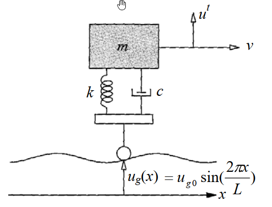

# SD-2011-2 — 單自由度、多自由度系統之動態分析及應用

**來源：** 結構工程技師高考 · 結構動力分析與耐震設計 · 第2題
**考年：** 2011（民國100年）
**主分類：** [[SD-U1-3]] 單自由度、多自由度系統之動態分析及應用
**副分類：** [[SD-U1-2]] 運動方程式推導
**分析方法：** SDOF基礎激振（路面粗糙度）：運動方程式建立、共振車速、無阻尼穩態反應
**標籤：** `SDOF` `基礎激振` `路面激振` `汽車動力學` `懸吊系統` `運動方程式` `相對位移座標` `等效激振力` `共振` `共振車速` `穩態反應` `頻率比` `傳導率` `無阻尼` `靜平衡消去`
**驗證狀態：** ⚠️ unverified（2026-08-22 稽核後修正過內容，待人工重新驗算）

---

## 題幹摘要

| 欄位 | 內容 |
|------|------|
| 題號 | SD-2011-2 |
| 考年 | 2011（民國100年） |
| 科目分類 | SD-U1-3（單自由度系統之動態分析及應用） |
| 副分類 | SD-U1-2（運動方程式推導） |
| 關鍵詞 | SDOF、基礎激振、路面激振、強迫振動、共振、穩態反應、傳導率、頻率比 |
| verificationStatus | **unverified**（待人工重新驗算）|

*（詳見 raw/solutions 完整解析）*

---

## 核心考點

**主要分類：** `SD-U1-3` 單自由度、多自由度系統之動態分析及應用

**分析方法：** SDOF基礎激振（路面粗糙度）：運動方程式建立、共振車速、無阻尼穩態反應

**關鍵標籤：** `SDOF` `基礎激振` `路面激振` `汽車動力學` `懸吊系統` `運動方程式` `相對位移座標` `等效激振力` `共振` `共振車速` `穩態反應` `頻率比` `傳導率` `無阻尼` `靜平衡消去`

---

## 解題關鍵步驟

（見完整解析）

---

## 用到的公式

（無）

---

## 涉及陷阱

（無）

---

## 相關題目

[[SD-2002-1]], [[SD-2002-2]], [[SD-2003-2]], [[SD-2003-3]], [[SD-2003-4]]

---

> 完整解析見 `raw/solutions/SD-2011-2/SD-2011-2.md`
> *由 compile-all 自動生成*
