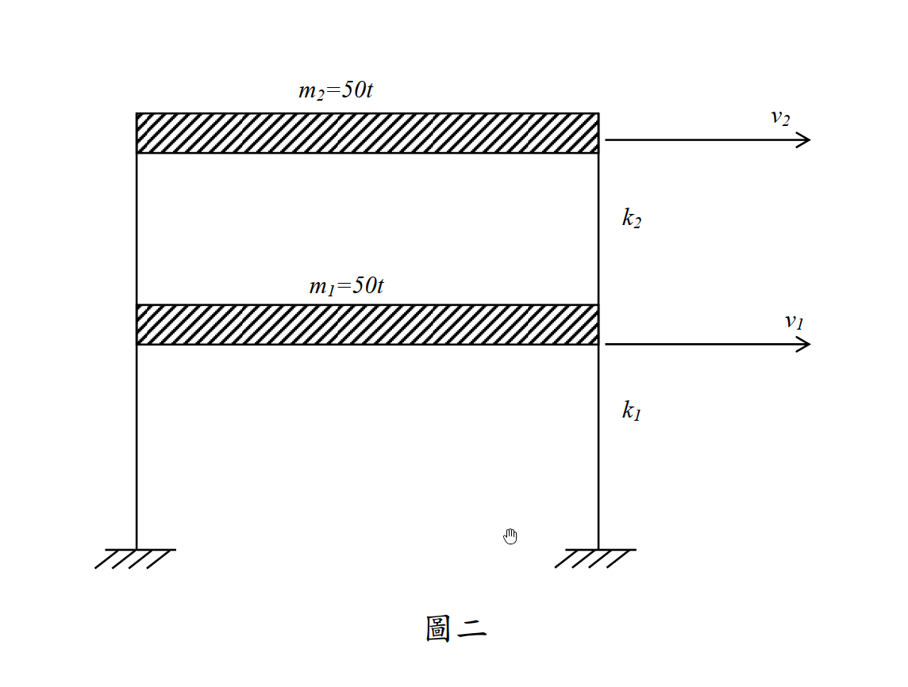

# SD-2015-2 — 單自由度、多自由度系統之動態分析及應用

**來源：** 結構工程技師高考 · 結構動力分析與耐震設計 · 第2題
**考年：** 2015（民國104年）
**主分類：** [[SD-U1-3]] 單自由度、多自由度系統之動態分析及應用
**副分類：** [[SD-U1-2]] 結構系統之數學模型及運動方程式
**分析方法：** MDOF 特徵值分析
**標籤：** `MDOF` `剪力屋架` `質量矩陣` `勁度矩陣` `特徵值問題` `自然頻率` `振態向量` `單位換算`
**驗證狀態：** ⚠️ unverified（2026-08-22 全庫重設，待人工驗算）

---

## 題幹摘要

### 結構條件

*圖說：兩層樓剪力屋架，各層質量 $m_1=m_2=50\text{ t}$，第一層層間勁度 $k_1=300\text{ tf/cm}$，第二層層間勁度 $k_2=200\text{ tf/cm}$。*

### 子題

1. 建立該系統之質量矩陣 $\mathbf{M}$ 與勁度矩陣 $\mathbf{K}$。（5 分）
2. 求該系統之自然頻率 $\omega_1, \omega_2$ 與對應之振態向量 $\boldsymbol{\phi}_1, \boldsymbol{\phi}_2$。（20 分）

---

## 核心考點

**主要分類：** `SD-U1-3` 單自由度、多自由度系統之動態分析及應用

**分析方法：** MDOF 特徵值分析

**關鍵標籤：** `MDOF` `剪力屋架` `質量矩陣` `勁度矩陣` `特徵值問題` `自然頻率` `振態向量` `單位換算`

---

## 解題關鍵步驟

**作戰順序：**
1. 依剪力建築假設組裝對角質量矩陣 $\mathbf{M}$ 與帶狀勁度矩陣 $\mathbf{K}$（$K_{11}=k_1+k_2$，$K_{22}=k_2$）
2. 注意單位換算：質量單位 $\text{t}$ 與勁度單位 $\text{tf/cm}$ 相除會殘留重力加速度 $g$（取 $g=981\text{ cm/s}^2$）
3. 求解特徵值方程式 $|\mathbf{K}-\omega^2\mathbf{M}|=0$，解出兩組特徵值
4. 代回 $(\mathbf{K}-\omega_n^2\mathbf{M})\boldsymbol{\phi}_n=\mathbf{0}$ 求各振態向量
5. 以正交性 $\boldsymbol{\phi}_1^T\mathbf{M}\boldsymbol{\phi}_2=0$ 驗算結果

**四大陷阱：**

| # | 陷阱 | 正確處理 |
|---|---|---|
| 1 | 單位換算錯誤 | $\text{tf/cm}/\text{t} = g\ (\text{cm/s}^2$ 量綱$)$，取 $g=981$，若忘記乘 $g$ 頻率會少 $\sqrt{981}$ 倍 |
| 2 | 勁度矩陣元素組合錯誤 | $K_{11}$ 須為 $k_1+k_2$ 而非僅 $k_1$；$K_{22}$ 才是 $k_2$ |
| 3 | 質量矩陣非對角化 | 題目已明示為剪力層架，質量集中於樓板，故 $\mathbf{M}$ 必為純對角矩陣 |
| 4 | 振態向量正交性未檢查 | 求得 $\boldsymbol{\phi}_1,\boldsymbol{\phi}_2$ 後應驗算 $\boldsymbol{\phi}_1^T\mathbf{M}\boldsymbol{\phi}_2=0$，確保無計算錯誤 |

---

## 用到的公式

[[SD-C-001]] 單自由度系統（SDOF）, [[SD-C-002]] 自然圓頻率（ω₀）與自然週期（T）, [[SD-C-008]] 振態向量（Mode Shape）

---

## 涉及陷阱

**作戰順序：**
1. 依剪力建築假設組裝對角質量矩陣 $\mathbf{M}$ 與帶狀勁度矩陣 $\mathbf{K}$（$K_{11}=k_1+k_2$，$K_{22}=k_2$）
2. 注意單位換算：質量單位 $\text{t}$ 與勁度單位 $\text{tf/cm}$ 相除會殘留重力加速度 $g$（取 $g=981\text{ cm/s}^2$）
3. 求解特徵值方程式 $|\mathbf{K}-\omega^2\mathbf{M}|=0$，解出兩組特徵值
4. 代回 $(\mathbf{K}-\omega_n^2\mathbf{M})\boldsymbol{\phi}_n=\mathbf{0}$ 求各振態向量
5. 以正交性 $\boldsymbol{\phi}_1^T\mathbf{M}\boldsymbol{\phi}_2=0$ 驗算結果

**四大陷阱：**

| # | 陷阱 | 正確處理 |
|---|---|---|
| 1 | 單位換算錯誤 | $\text{tf/cm}/\text{t} = g\ (\text{cm/s}^2$ 量綱$)$，取 $g=981$，若忘記乘 $g$ 頻率會少 $\sqrt{981}$ 倍 |
| 2 | 勁度矩陣元素組合錯誤 | $K_{11}$ 須為 $k_1+k_2$ 而非僅 $k_1$；$K_{22}$ 才是 $k_2$ |
| 3 | 質量矩陣非對角化 | 題目已明示為剪力層架，質量集中於樓板，故 $\mathbf{M}$ 必為純對角矩陣 |
| 4 | 振態向量正交性未檢查 | 求得 $\boldsymbol{\phi}_1,\boldsymbol{\phi}_2$ 後應驗算 $\boldsymbol{\phi}_1^T\mathbf{M}\boldsymbol{\phi}_2=0$，確保無計算錯誤 |

---

## 相關題目

[[SD-2005-2]], [[SD-2008-1]], [[SD-2016-1]], [[SD-2019-1]]

---

> 完整解析見 `raw/solutions/SD-2015-2/SD-2015-2.md`
> *由 Cowork ingest 生成*
