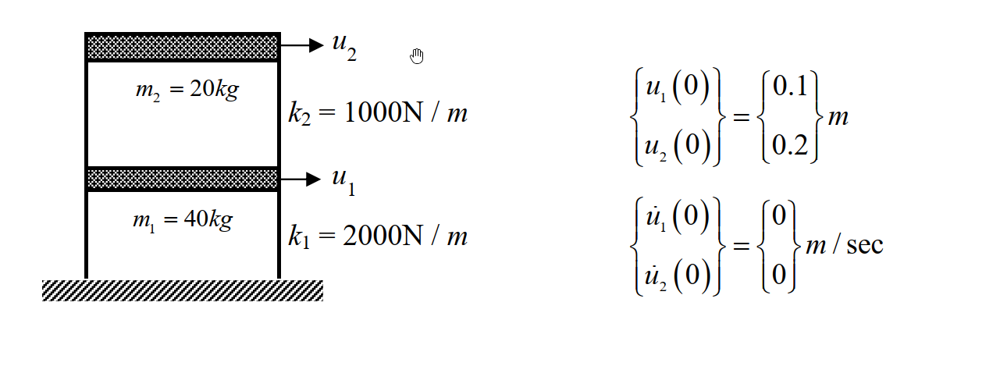

# SD-2019-2 — 單自由度、多自由度系統之動態分析及應用

**來源：** 結構工程技師高考 · 結構動力分析與耐震設計 · 第2題
**考年：** 2019（民國108年）
**主分類：** [[SD-U1-3]] 單自由度、多自由度系統之動態分析及應用
**副分類：** [[SD-U1-2]] 結構系統之數學模型及運動方程式
**分析方法：** 雙層剪力屋架動力分析
**標籤：** `剪力屋架` `MDOF` `運動方程式` `特徵方程式` `自然頻率` `振態` `自由振動` `初始條件` `純模態反應`
**驗證狀態：** ⚠️ unverified（2026-08-22 全庫重設，待人工驗算）

---

## 題幹摘要

### 結構條件

*圖說：兩層樓剪力屋架。第一層質量 $m_1=40\text{ kg}$、層間勁度 $k_1=2000\text{ N/m}$；第二層質量 $m_2=20\text{ kg}$、層間勁度 $k_2=1000\text{ N/m}$。初始位移 $\{u_1(0),u_2(0)\}=\{0.1, 0.2\}\text{ m}$，初始速度為零。*

### 子題

1. 求出運動方程式。（3 分）
2. 求出振動頻率及所對應之振態。（6 分）
3. 當此剪力屋架受到上述起始條件，其位移反應為何？請用時間的函數表示。（16 分）

---

## 核心考點

**主要分類：** `SD-U1-3` 單自由度、多自由度系統之動態分析及應用

**分析方法：** 雙層剪力屋架動力分析

**關鍵標籤：** `剪力屋架` `MDOF` `運動方程式` `特徵方程式` `自然頻率` `振態` `自由振動` `初始條件` `純模態反應`

---

## 解題關鍵步驟

**作戰順序：**
1. 依剪力屋架公式 $M\ddot{U}+KU=0$ 組裝質量矩陣 $M$ 與勁度矩陣 $K$（$K_{11}=k_1+k_2$）
2. 解特徵值問題 $\det(K-\omega^2M)=0$ 求 $\omega_1,\omega_2$
3. 代回 $(K-\omega^2M)\phi=0$ 求振態 $\phi_1,\phi_2$
4. 由初始速度為零知正弦項係數 $B_i=0$；再將初始位移代入 $U(0)=A_1\phi_1+A_2\phi_2$ 求 $A_1,A_2$
5. 觀察初始位移是否恰與某一振態成比例，可簡化為純模態反應

**四大陷阱：**

| # | 陷阱 | 正確處理 |
|---|---|---|
| 1 | 勁度矩陣組裝錯誤 | 剪力屋架 $K_{11}=k_1+k_2=3000$，切勿只寫 $2000$ |
| 2 | 計算特徵方程式出錯 | 展開行列式時容易算錯係數，建議提早約分（如同除以 $m_1\times m_2$） |
| 3 | 盲目套用公式計算模態參與係數 | 可先觀察初始條件是否恰為某振態的比例形式，直接判斷 $A_2=0$，省去大量計算 |
| 4 | 忽略初速條件 | 題目給定初速為零，因此正弦項的係數 $B_i=0$ |

---

## 用到的公式

[[SD-C-008]] 振態向量（Mode Shape）, [[SD-C-007]] 模態疊加法（Modal Superposition）

---

## 涉及陷阱

**作戰順序：**
1. 依剪力屋架公式 $M\ddot{U}+KU=0$ 組裝質量矩陣 $M$ 與勁度矩陣 $K$（$K_{11}=k_1+k_2$）
2. 解特徵值問題 $\det(K-\omega^2M)=0$ 求 $\omega_1,\omega_2$
3. 代回 $(K-\omega^2M)\phi=0$ 求振態 $\phi_1,\phi_2$
4. 由初始速度為零知正弦項係數 $B_i=0$；再將初始位移代入 $U(0)=A_1\phi_1+A_2\phi_2$ 求 $A_1,A_2$
5. 觀察初始位移是否恰與某一振態成比例，可簡化為純模態反應

**四大陷阱：**

| # | 陷阱 | 正確處理 |
|---|---|---|
| 1 | 勁度矩陣組裝錯誤 | 剪力屋架 $K_{11}=k_1+k_2=3000$，切勿只寫 $2000$ |
| 2 | 計算特徵方程式出錯 | 展開行列式時容易算錯係數，建議提早約分（如同除以 $m_1\times m_2$） |
| 3 | 盲目套用公式計算模態參與係數 | 可先觀察初始條件是否恰為某振態的比例形式，直接判斷 $A_2=0$，省去大量計算 |
| 4 | 忽略初速條件 | 題目給定初速為零，因此正弦項的係數 $B_i=0$ |

---

## 相關題目

[[SD-2007-2]], [[SD-2016-1]], [[SD-2021-3]]

---

> 完整解析見 `raw/solutions/SD-2019-2/SD-2019-2.md`
> *由 Cowork ingest 生成*
