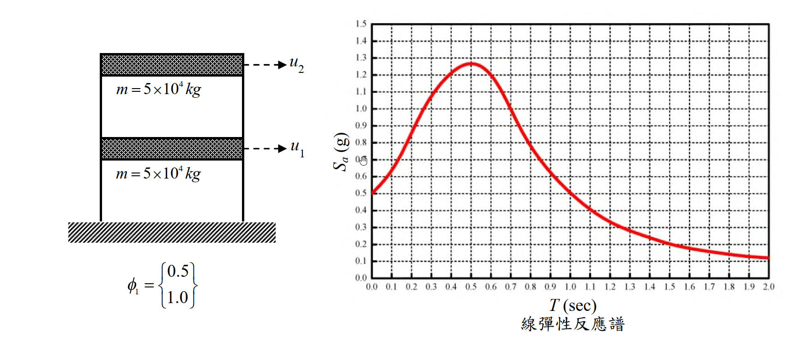

# SD-2019-3 — 單自由度、多自由度系統之動態分析及應用

**來源：** 結構工程技師高考 · 結構動力分析與耐震設計 · 第3題
**考年：** 2019（民國108年）
**主分類：** [[SD-U1-3]] 單自由度、多自由度系統之動態分析及應用
**副分類：** [[SD-U2-2]] 建築耐震設計規範
**分析方法：** 反應譜分析與等位移法則
**標籤：** `反應譜` `MDOF` `位移不變法則` `韌性` `等效質量` `振態參與係數` `基礎剪力` `層間位移`
**驗證狀態：** ⚠️ unverified（2026-08-22 全庫重設，待人工驗算）

---

## 題幹摘要

### 結構條件

*圖說：兩層樓建築，樓層質量均為 $m=5\times10^4\text{ kg}$，基本振動週期 $T=1.0\text{ sec}$，第一振態 $\phi_1=\{0.5,1.0\}^T$。極限狀態彈性反應譜於 $T=1.0\text{ sec}$ 時 $S_a=0.5g$。*

### 子題

依「位移不變法則（Equal Displacement Principle）」及僅考慮基本振態，回答：
1. 當位移韌性達 5 時，其基礎剪力為何？（15 分）
2. 在此地震力作用下，分別求上下兩層的層間位移？（10 分）

---

## 核心考點

**主要分類：** `SD-U1-3` 單自由度、多自由度系統之動態分析及應用

**分析方法：** 反應譜分析與等位移法則

**關鍵標籤：** `反應譜` `MDOF` `位移不變法則` `韌性` `等效質量` `振態參與係數` `基礎剪力` `層間位移`

---

## 解題關鍵步驟

**作戰順序：**
1. 計算第一振態的廣義質量 $M_1=\phi_1^TM\phi_1$、廣義動量 $L_1=\phi_1^TM\mathbf{1}$、參與係數 $\Gamma_1=L_1/M_1$、有效模態質量 $M_1^*=L_1^2/M_1$
2. 由 $V_e=M_1^*\cdot S_a$ 求彈性基礎剪力
3. 應用位移不變法則：中長週期結構力量折減係數 $R=\mu$，故 $V_y=V_e/\mu$
4. 求譜位移 $S_d=S_a/\omega^2$，並由 $U=\Gamma_1S_d\phi_1$ 求樓層位移
5. 相鄰樓層位移相減得層間位移（等位移法則下非彈性層間位移等於彈性層間位移）

**四大陷阱：**

| # | 陷阱 | 正確處理 |
|---|---|---|
| 1 | 誤將單層質量視為總質量 | 彈性基礎剪力 $V_e$ 應由有效模態質量 $M_1^*$ 乘上 $S_a$，而非總質量 $M_{tot}\cdot S_a$ |
| 2 | 未轉換譜位移 $S_d$ | 直接將 $S_a$ 當位移代入是致命錯誤，必須透過 $S_d=S_a/\omega^2$ 轉換 |
| 3 | 不熟悉等位移法則的定義 | 誤以為 $\Delta_u=\mu\Delta_e$；中長週期的等位移法則為 $\Delta_u=\Delta_e$ 且 $V_y=V_e/\mu$ |
| 4 | $g$ 值單位混淆 | 計算 $V_e$ 用 $g=9.81\text{ m/s}^2$（得 N），計算 $S_d$ 用 $g=981\text{ cm/s}^2$（得 cm），需一致 |

---

## 用到的公式

[[SD-C-005]] 反應譜（Response Spectrum）, [[SD-C-009]] 模態參與因子（Γᵢ）與有效質量（Modal Participation Factor and Effective Mass）

---

## 涉及陷阱

**作戰順序：**
1. 計算第一振態的廣義質量 $M_1=\phi_1^TM\phi_1$、廣義動量 $L_1=\phi_1^TM\mathbf{1}$、參與係數 $\Gamma_1=L_1/M_1$、有效模態質量 $M_1^*=L_1^2/M_1$
2. 由 $V_e=M_1^*\cdot S_a$ 求彈性基礎剪力
3. 應用位移不變法則：中長週期結構力量折減係數 $R=\mu$，故 $V_y=V_e/\mu$
4. 求譜位移 $S_d=S_a/\omega^2$，並由 $U=\Gamma_1S_d\phi_1$ 求樓層位移
5. 相鄰樓層位移相減得層間位移（等位移法則下非彈性層間位移等於彈性層間位移）

**四大陷阱：**

| # | 陷阱 | 正確處理 |
|---|---|---|
| 1 | 誤將單層質量視為總質量 | 彈性基礎剪力 $V_e$ 應由有效模態質量 $M_1^*$ 乘上 $S_a$，而非總質量 $M_{tot}\cdot S_a$ |
| 2 | 未轉換譜位移 $S_d$ | 直接將 $S_a$ 當位移代入是致命錯誤，必須透過 $S_d=S_a/\omega^2$ 轉換 |
| 3 | 不熟悉等位移法則的定義 | 誤以為 $\Delta_u=\mu\Delta_e$；中長週期的等位移法則為 $\Delta_u=\Delta_e$ 且 $V_y=V_e/\mu$ |
| 4 | $g$ 值單位混淆 | 計算 $V_e$ 用 $g=9.81\text{ m/s}^2$（得 N），計算 $S_d$ 用 $g=981\text{ cm/s}^2$（得 cm），需一致 |

---

## 相關題目

[[SD-2004-5]], [[SD-2014-1]], [[SD-2021-4]]

---

> 完整解析見 `raw/solutions/SD-2019-3/SD-2019-3.md`
> *由 Cowork ingest 生成*
